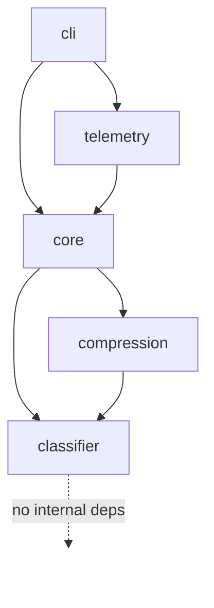
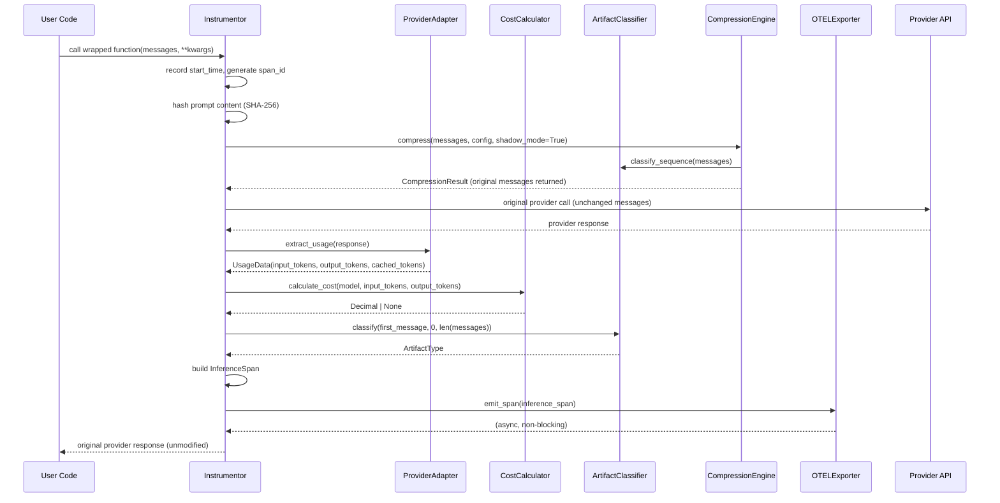
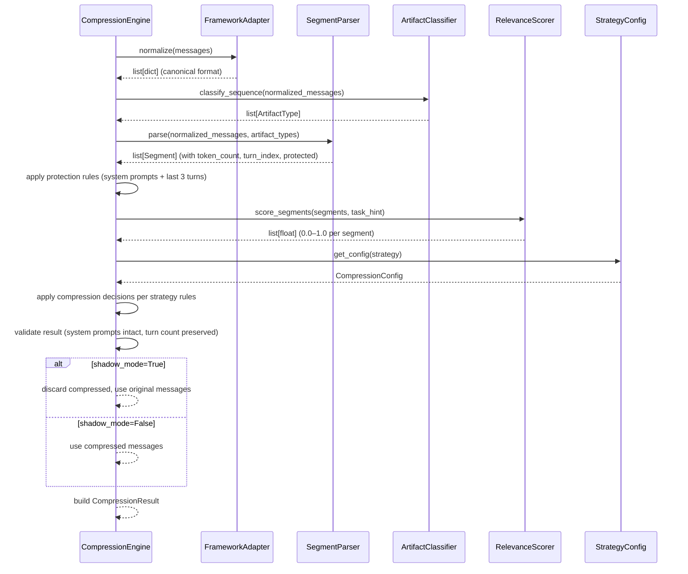

# Design Document: Axon SDK — Phase 1

## Overview

Axon is a Python SDK that instruments LLM API calls to produce structured
OpenTelemetry spans with cost attribution, artifact classification, and
trajectory compression. It wraps existing OpenAI and Anthropic clients via a
single decorator or patch call, adding observability at the infrastructure
layer with no behavioral change required from the developer.

Phase 1 delivers a pip-installable package (`axon-sdk`) with five subsystems:
instrumentation, artifact classification, trajectory compression (shadow mode),
OTEL telemetry export, and a CLI. There is no backend service, no database, and
no network dependency beyond the provider APIs the user already calls. The
embedding model for compression scoring runs fully in-process.

The design is organized as follows: the High-Level section covers system
architecture, component boundaries, data flow, and interface contracts. The
Low-Level section covers Python type signatures, algorithmic pseudocode with
formal pre/postconditions, and correctness properties.

---

## Part 1: High-Level Design

### 1.1 System Context

```mermaid
graph TD
    subgraph "User Application"
        UC[User Code]
    end

    subgraph "Axon SDK"
        INST[Instrumentor<br/>core/instrumentor.py]
        PA[Provider Adapter<br/>core/provider_adapter.py]
        CC[Cost Calculator<br/>core/cost_calculator.py]
        CL[Artifact Classifier<br/>classifier/artifact_type.py]
        CE[Compression Engine<br/>compression/engine.py]
        OE[OTEL Exporter<br/>telemetry/otel_exporter.py]
        CLI[CLI<br/>cli/main.py]
    end

    subgraph "External"
        OAI[OpenAI API]
        ANT[Anthropic API]
        OTLP[OTLP Collector<br/>optional]
        STDOUT[stdout / console]
    end

    UC -->|@instrument / patch| INST
    INST --> PA
    INST --> CC
    INST --> CL
    INST --> CE
    INST --> OE
    PA -->|HTTP| OAI
    PA -->|HTTP| ANT
    OE -->|gRPC| OTLP
    OE --> STDOUT
    CLI -->|reads JSONL| UC
```

### 1.2 Module Dependency Graph

The dependency direction is strictly enforced (no cycles, no upward imports):



**Dependency rules (non-negotiable per standards.md):**
- `classifier` → nothing internal
- `compression` → `classifier` only
- `core` → `classifier` + `compression`
- `telemetry` → `core`
- `cli` → `core` + `telemetry`

### 1.3 Call Flow: Instrumented LLM Call



### 1.4 Compression Pipeline Flow



### 1.5 Components and Interfaces

#### 1.5.1 Instrumentor (`axon/core/instrumentor.py`)

**Purpose**: Entry point for all SDK instrumentation. Wraps provider calls,
orchestrates the pipeline, and guarantees the caller's response is never
modified or suppressed.

**Interface**:
```python
def instrument(
    feature_tag: str = "default",
    shadow_mode: bool = True,
    strategy: CompressionStrategy = CompressionStrategy.CONSERVATIVE,
    environment: str = "production",
) -> Callable[..., Any]: ...

def patch(
    client: Any,
    feature_tag: str = "default",
    shadow_mode: bool = True,
    strategy: CompressionStrategy = CompressionStrategy.CONSERVATIVE,
    environment: str = "production",
) -> None: ...

def configure(
    otlp_endpoint: str | None = None,
    export_to_stdout: bool = True,
    local_span_log: str | None = None,
) -> None: ...
```

**Responsibilities**:
- Wrap sync and async callables transparently
- Record wall-clock duration around the provider call
- Hash prompt content before any telemetry emission
- Run compression pipeline in shadow mode by default
- Catch all `AxonError` subclasses internally; never suppress caller exceptions
- Emit `InferenceSpan` via `OTELExporter` after every successful call

#### 1.5.2 Provider Adapter (`axon/core/provider_adapter.py`)

**Purpose**: Normalize provider-specific response shapes into a uniform
`UsageData` structure. Isolates all provider-specific field access.

**Interface**:
```python
class ProviderAdapter(ABC):
    @abstractmethod
    def extract_usage(self, response: Any) -> UsageData: ...

    @abstractmethod
    def extract_model(self, response: Any) -> str: ...

    @abstractmethod
    def is_streaming(self, response: Any) -> bool: ...

@dataclass
class UsageData:
    input_tokens: int
    output_tokens: int
    cached_tokens: int
    token_count_method: Literal["exact", "estimated"]

class OpenAIAdapter(ProviderAdapter): ...
class AnthropicAdapter(ProviderAdapter): ...

def get_adapter(provider: str) -> ProviderAdapter: ...
```

**Responsibilities**:
- Read `usage.prompt_tokens` / `usage.completion_tokens` from OpenAI responses
- Read `usage.input_tokens` / `usage.output_tokens` from Anthropic responses
- Detect streaming responses and fall back to tiktoken estimation
- Mark `token_count_method="estimated"` when tiktoken is used
- Raise `AxonProviderError` for unknown providers

#### 1.5.3 Cost Calculator (`axon/core/cost_calculator.py`)

**Purpose**: Convert token counts to `Decimal` cost using the static pricing
table. Never raises on unknown models — returns `None` with a logged warning.

**Interface**:
```python
def calculate_cost(
    model: str,
    input_tokens: int,
    output_tokens: int,
    cached_tokens: int = 0,
) -> Decimal | None: ...

def get_pricing(model: str) -> ModelPricing | None: ...
```

**Responsibilities**:
- Look up model in `PROVIDER_PRICING` dict
- Apply formula: `(input_tokens / 1_000_000) * input_cost + (output_tokens / 1_000_000) * output_cost`
- Subtract cached token savings when `cache_read_cost_per_1m_tokens` is present
- Return `None` (not raise) for unknown models; log warning via structlog

#### 1.5.4 Artifact Classifier (`axon/classifier/artifact_type.py`)

**Purpose**: Deterministic, heuristic-only classification of message segments
into one of 9 artifact types. Zero false negatives on `SYSTEM_PROMPT`.

**Interface**:
```python
class ArtifactType(str, Enum):
    SYSTEM_PROMPT = "system_prompt"
    USER_MESSAGE = "user_message"
    ASSISTANT_MESSAGE = "assistant_message"
    TOOL_RESULT = "tool_result"
    TOOL_CALL = "tool_call"
    RAG_CHUNK = "rag_chunk"
    FEW_SHOT_EXAMPLE = "few_shot_example"
    REASONING_BLOCK = "reasoning_block"
    UNKNOWN = "unknown"

def classify(
    message: dict[str, Any],
    position_index: int,
    total_messages: int,
) -> ArtifactType: ...

def classify_sequence(messages: list[dict[str, Any]]) -> list[ArtifactType]: ...
```

**Responsibilities**:
- Apply heuristics in strict priority order (see Section 2.3)
- Complete in < 1ms per message (no ML, no I/O)
- `role == "system"` always returns `SYSTEM_PROMPT` — no override possible

#### 1.5.5 Compression Engine (`axon/compression/engine.py`)

**Purpose**: Run the full compression pipeline. In shadow mode (default),
always return the original messages. Record what would have been compressed.

**Interface**:
```python
def compress(
    messages: list[dict[str, Any]],
    config: CompressionConfig,
    task_hint: str | None = None,
    adapter: FrameworkAdapter | None = None,
) -> CompressionResult: ...
```

**Responsibilities**:
- Detect and use the correct framework adapter if not provided
- Apply protection rules before scoring (system prompts + last 3 turns)
- Score segments using composite formula (recency 0.4, semantic 0.4, reference 0.2)
- Apply strategy-specific compression decisions
- Validate result integrity; fall back to original on `AxonCompressionError`
- In shadow mode: populate `CompressionResult` with what-would-happen data,
  but set `messages` to the original unmodified array

#### 1.5.6 Relevance Scorer (`axon/compression/relevance_scorer.py`)

**Purpose**: Score each segment's relevance using a composite of recency,
semantic similarity, and reference count. Uses local embedding model only.

**Interface**:
```python
def score_segments(
    segments: list[Segment],
    task_hint: str | None = None,
) -> list[float]: ...
```

**Responsibilities**:
- Load `all-MiniLM-L6-v2` once at module import; cache for process lifetime
- Protected segments always return score `1.0`
- Recency: `exp(-decay_rate * turns_since_segment)` where `decay_rate = 0.3`
- Semantic: cosine similarity of segment embedding vs. task hint embedding;
  defaults to `1.0` if no task hint provided
- Reference: `min(1.0, reference_count / 3)` where reference count is the
  number of later segments that reference this segment's content
- Composite: `0.4 * recency + 0.4 * semantic + 0.2 * reference`

#### 1.5.7 Framework Adapters (`axon/compression/adapters/`)

**Purpose**: Normalize framework-specific message formats to canonical
`list[dict]` and denormalize back. Isolated per framework.

**Interface**:
```python
class FrameworkAdapter(ABC):
    @abstractmethod
    def normalize(self, messages: Any) -> list[dict[str, Any]]: ...

    @abstractmethod
    def denormalize(
        self, messages: list[dict[str, Any]], original: Any
    ) -> Any: ...

    @classmethod
    @abstractmethod
    def accepts(cls, messages: Any) -> bool: ...
```

**Adapters**:
- `RawOpenAIAdapter`: handles `list[dict]` with `role`/`content` keys
- `LangChainAdapter`: handles `BaseMessage` subclasses; guarded import
- `AutoGenAdapter`: handles AutoGen message dicts; guarded import

**Responsibilities**:
- Guard framework imports with `try/except ImportError`; raise `AxonDependencyError`
- `accepts()` is a classmethod used for auto-detection
- `normalize()` must produce canonical `{"role": str, "content": str}` dicts

#### 1.5.8 OTEL Exporter (`axon/telemetry/otel_exporter.py`)

**Purpose**: Convert `InferenceSpan` Pydantic models to OTEL spans and export
via ConsoleSpanExporter (default) or OTLPSpanExporter (when env var is set).

**Interface**:
```python
def configure_exporter(
    otlp_endpoint: str | None = None,
    export_to_stdout: bool = True,
) -> None: ...

def emit_span(span_data: InferenceSpan) -> None: ...
```

**OTEL Attribute Mapping**:

| InferenceSpan field | OTEL attribute |
|---|---|
| `provider` | `gen_ai.system` |
| `model` | `gen_ai.request.model` |
| `input_tokens` | `gen_ai.usage.input_tokens` |
| `output_tokens` | `gen_ai.usage.output_tokens` |
| `cost_usd` | `axon.cost_usd` |
| `feature_tag` | `axon.feature_tag` |
| `prompt_hash` | `axon.prompt_hash` |
| `artifact_type` | `axon.artifact_type` |
| `compression_applied` | `axon.compression.applied` |
| `shadow_mode` | `axon.compression.shadow_mode` |
| `tokens_saved` | `axon.compression.tokens_saved` |
| `cache_hit` | `axon.cache_hit` |
| `environment` | `axon.environment` |

**Responsibilities**:
- `configure_exporter()` is idempotent; safe to call multiple times
- Read `AXON_OTLP_ENDPOINT` env var to activate OTLP exporter
- Span name format: `gen_ai.{provider}.{model}` (e.g., `gen_ai.openai.gpt-4o`)
- `cost_usd` serialized as string to preserve Decimal precision in OTEL

#### 1.5.9 CLI (`axon/cli/main.py`)

**Purpose**: Developer-facing CLI for analyzing local span logs and checking
SDK health.

**Commands**:

| Command | Description |
|---|---|
| `axon analyze --input <file.jsonl> [--format table\|json]` | Parse JSONL of InferenceSpan records; output cost summary |
| `axon version` | Print `axon-sdk 0.1.0` |
| `axon doctor` | Check required dependencies; exit 0 if all present, 1 if any missing |

**`axon analyze` output columns** (rich table):
- Model, Feature Tag, Calls, Input Tokens, Output Tokens, Cost (USD),
  Shadow Savings (tokens), Cache Hits

**`axon doctor` checks**:
- `sentence-transformers` importable
- `openai` or `anthropic` importable (at least one)
- `opentelemetry-sdk` importable
- `tiktoken` importable

### 1.6 Data Models

All cross-boundary data structures are Pydantic v2 models or frozen dataclasses.
Raw `dict` objects are only used as local intermediates within a single function.

#### 1.6.1 `InferenceSpan` (`axon/models.py`)

```python
class InferenceSpan(BaseModel):
    """Immutable record of a single instrumented LLM API call."""

    id: UUID
    trace_id: str
    parent_span_id: str | None
    span_name: str
    timestamp: datetime
    duration_ms: int
    provider: str
    model: str
    api_version: str | None
    input_tokens: int
    output_tokens: int
    cached_tokens: int
    token_count_method: Literal["exact", "estimated"]
    cost_usd: Decimal | None
    feature_tag: str
    prompt_hash: str          # SHA-256 of normalized prompt content
    artifact_type: ArtifactType
    compression_applied: bool
    shadow_mode: bool
    pre_compression_tokens: int | None
    tokens_saved: int | None
    cache_hit: bool
    environment: str
```

**Validation rules**:
- `duration_ms >= 0`
- `input_tokens >= 0`, `output_tokens >= 0`, `cached_tokens >= 0`
- `prompt_hash` matches `^[a-f0-9]{64}$` (64-char hex SHA-256)
- `cost_usd` is `None` or a non-negative `Decimal`

#### 1.6.2 `Segment` (`axon/models.py`)

```python
class Segment(BaseModel):
    """A single message segment within a compression analysis."""

    index: int
    role: str
    content: str
    artifact_type: ArtifactType
    token_count: int
    turn_index: int
    protected: bool
    embedding: list[float] | None = None
```

**Validation rules**:
- `token_count >= 0`
- `turn_index >= 0`
- `embedding` is `None` or a list of exactly 384 floats (all-MiniLM-L6-v2 dim)

#### 1.6.3 `CompressionResult` (`axon/models.py`)

```python
class CompressionResult(BaseModel):
    """Result of a compression pipeline run."""

    original_tokens: int
    compressed_tokens: int
    tokens_saved: int
    compression_ratio: float
    segments_analyzed: int
    segments_retained: int
    segments_summarized: int
    segments_dropped: int
    shadow_mode: bool
    strategy_applied: CompressionStrategy
    messages: list[dict[str, Any]]
    warnings: list[str]
```

**Validation rules**:
- `0.0 <= compression_ratio <= 1.0`
- `tokens_saved == original_tokens - compressed_tokens`
- `segments_retained + segments_summarized + segments_dropped == segments_analyzed`
- In shadow mode: `compressed_tokens == original_tokens` and `tokens_saved == 0`

#### 1.6.4 `ModelPricing` (`axon/models.py`)

```python
@dataclass(frozen=True)
class ModelPricing:
    """Verified pricing for a single model."""

    provider: str
    model: str
    input_cost_per_1m_tokens: Decimal
    output_cost_per_1m_tokens: Decimal
    cache_read_cost_per_1m_tokens: Decimal | None
    cache_write_cost_per_1m_tokens: Decimal | None
    pricing_url: str
    last_verified: date
```

#### 1.6.5 `CompressionConfig` (`axon/compression/strategies.py`)

```python
@dataclass(frozen=True)
class CompressionConfig:
    """Immutable configuration for a compression run."""

    strategy: CompressionStrategy
    target_reduction_pct: float
    min_turns_protected: int
    protect_system_prompt: bool
    shadow_mode: bool
```

#### 1.6.6 `UsageData` (`axon/core/provider_adapter.py`)

```python
@dataclass
class UsageData:
    """Normalized token usage from a provider response."""

    input_tokens: int
    output_tokens: int
    cached_tokens: int
    token_count_method: Literal["exact", "estimated"]
```

### 1.7 Error Handling

#### Error Hierarchy (`axon/exceptions.py`)

```
AxonError (base)
├── AxonConfigError       — invalid configuration values
├── AxonDependencyError   — optional framework not installed
├── AxonCompressionError  — compression pipeline failure
└── AxonProviderError     — unknown or unsupported provider
```

#### Error Scenarios

| Scenario | Exception | Behavior |
|---|---|---|
| Unknown model in pricing table | — | Return `cost_usd=None`, log warning |
| Axon pipeline failure during instrumented call | `AxonError` | Log error, return original response |
| Caller's LLM call raises | Any | Re-raise unchanged; Axon never swallows |
| Framework not installed | `AxonDependencyError` | Raised at adapter construction time |
| Invalid `CompressionConfig` | `AxonConfigError` | Raised at `validate_config()` |
| Compression result fails validation | `AxonCompressionError` | Fall back to original messages, log warning |
| Unknown provider string | `AxonProviderError` | Raised by `get_adapter()` |

**Key invariant**: If the user's LLM call succeeds, the user always receives
the original provider response. Axon failures are logged and silently absorbed.

### 1.8 Testing Strategy

#### Unit Testing

Every public function has at least one test. Test files mirror source files:
`axon/core/foo.py` → `tests/unit/test_foo.py`.

Key test categories:
- **Classifier**: all 9 artifact types, system prompt zero false negatives
  (parametrized over 20 context shapes), edge cases (empty content, missing role)
- **Cost calculator**: all 9 models, zero tokens, cached-only, unknown model,
  Decimal precision (no float drift)
- **Compression engine**: shadow mode invariant (output == input), protection
  rules (system prompt never dropped, last 3 turns never dropped), all 3
  strategies, empty context, single-message context
- **Instrumentor**: sync decorator, async decorator, patch on mock client,
  Axon error during pipeline (must not suppress caller exception)
- **OTEL exporter**: attribute mapping correctness, idempotent configure

#### Property-Based Testing

Library: `hypothesis`

Properties to test:
- `classify(msg, i, n)` where `msg["role"] == "system"` always returns
  `SYSTEM_PROMPT` for any `i`, `n`, and content
- `compress(messages, config, shadow_mode=True).messages == messages` for
  any valid messages array
- `calculate_cost(model, a, b) >= Decimal(0)` for all known models and
  non-negative token counts
- `compression_ratio` is always in `[0.0, 1.0]`

#### Integration Testing

- `test_openai_instrumentation.py`: mock HTTP via `respx`; verify span emitted
  with correct token counts and cost
- `test_langchain_instrumentation.py`: mock LangChain chain; verify adapter
  normalization and span emission

#### Benchmarks

- `bench_sdk_overhead.py`: 1000 calls with mock provider; assert median < 5ms
- `bench_compression_latency.py`: 5/10/20/50 segments; assert p50 < 50ms
  for 20-segment context

### 1.9 Security Considerations

- **Prompt privacy**: All prompt content is hashed with SHA-256 (normalized:
  stripped whitespace, lowercased) before any telemetry emission. Raw text
  never touches disk, logs, or OTEL spans.
- **API key isolation**: Axon wraps the user's existing client object. It never
  reads, stores, or logs provider API keys.
- **No network calls from compression**: The embedding model runs in-process.
  No prompt content leaves the user's machine during compression scoring.
- **Dependency isolation**: Optional framework imports are guarded. A missing
  optional dependency raises `AxonDependencyError` with a clear install
  instruction, not an `ImportError` with a stack trace.

### 1.10 Performance Considerations

| Constraint | Target | Verification |
|---|---|---|
| SDK instrumentation overhead | < 5ms median | `bench_sdk_overhead.py` |
| Artifact classification | < 1ms per message | Unit test with `time.perf_counter` |
| Compression pipeline (20 segments) | < 50ms p50 | `bench_compression_latency.py` |
| Embedding model load | Once at import | Module-level singleton |
| OTEL span emission | Non-blocking | Fire-and-forget via OTEL SDK |

The embedding model (`all-MiniLM-L6-v2`, 22MB, 384-dim) is loaded once at
`relevance_scorer` module import and held as a module-level singleton. This
means the first import pays the load cost (~200ms on CPU); subsequent calls
are fast (~5ms per batch).

### 1.11 Dependencies

**Runtime**:
- `opentelemetry-sdk>=1.24`, `opentelemetry-api>=1.24`,
  `opentelemetry-exporter-otlp-proto-grpc>=1.24`
- `pydantic>=2.6`
- `structlog>=24.1`
- `sentence-transformers>=3.0`
- `tiktoken>=0.7`
- `typer>=0.12`, `rich>=13.0`

**Optional**:
- `openai>=1.30` (via `pip install axon-sdk[openai]`)
- `anthropic>=0.28` (via `pip install axon-sdk[anthropic]`)
- `langchain-core>=0.2` (via `pip install axon-sdk[langchain]`)
- `pyautogen>=0.2` (via `pip install axon-sdk[autogen]`)

**Dev**:
- `pytest>=8.0`, `pytest-asyncio>=0.23`, `pytest-cov>=5.0`
- `respx>=0.21`, `hypothesis>=6.0`
- `mypy>=1.10`, `ruff>=0.4`, `pre-commit>=3.7`

---

## Part 2: Low-Level Design

### 2.1 Instrumentation Layer

#### `instrument()` — Decorator Factory

```python
def instrument(
    feature_tag: str = "default",
    shadow_mode: bool = True,
    strategy: CompressionStrategy = CompressionStrategy.CONSERVATIVE,
    environment: str = "production",
) -> Callable[..., Any]:
    """Return a decorator that instruments an LLM call function.

    Args:
        feature_tag: Logical grouping label for cost attribution.
        shadow_mode: If True, compression runs but original messages returned.
        strategy: Compression strategy to apply.
        environment: Deployment environment label for span metadata.

    Returns:
        A decorator that wraps sync or async callables.
    """
```

**Preconditions**:
- `feature_tag` is a non-empty string
- `strategy` is a valid `CompressionStrategy` enum member
- `environment` is a non-empty string

**Postconditions**:
- Returns a callable that, when applied to a function `f`, returns a wrapper
  with the same signature as `f`
- The wrapper returns the same value as `f` would have returned
- If `f` raises, the wrapper re-raises the same exception unchanged
- If the Axon pipeline raises `AxonError`, it is caught, logged, and the
  original response is returned

**Algorithm**:

```python
def instrument(feature_tag, shadow_mode, strategy, environment):
    config = get_config(strategy)
    config = CompressionConfig(
        strategy=strategy,
        target_reduction_pct=config.target_reduction_pct,
        min_turns_protected=config.min_turns_protected,
        protect_system_prompt=True,
        shadow_mode=shadow_mode,
    )

    def decorator(fn):
        if asyncio.iscoroutinefunction(fn):
            @functools.wraps(fn)
            async def async_wrapper(*args, **kwargs):
                return await _run_instrumented(
                    fn, args, kwargs, config, feature_tag, environment
                )
            return async_wrapper
        else:
            @functools.wraps(fn)
            def sync_wrapper(*args, **kwargs):
                return asyncio.get_event_loop().run_until_complete(
                    _run_instrumented(fn, args, kwargs, config, feature_tag, environment)
                ) if asyncio.iscoroutinefunction(fn) else _run_instrumented_sync(
                    fn, args, kwargs, config, feature_tag, environment
                )
            return sync_wrapper

    return decorator
```

**`_run_instrumented_sync` algorithm**:

```python
def _run_instrumented_sync(fn, args, kwargs, config, feature_tag, environment):
    logger = structlog.get_logger(__name__)
    start = time.perf_counter()
    span_id = uuid4()
    trace_id = _get_or_create_trace_id()

    # Extract messages for compression (best-effort; skip if not found)
    messages = _extract_messages(args, kwargs)
    prompt_hash = _hash_prompt(messages) if messages else _hash_prompt([])

    # Run compression pipeline (shadow mode by default)
    compression_result: CompressionResult | None = None
    if messages:
        try:
            compression_result = compress(messages, config)
        except AxonError as exc:
            logger.warning("axon.compression.failed", error=str(exc))

    # Call the original function with ORIGINAL messages (never compressed in shadow)
    response = fn(*args, **kwargs)

    duration_ms = int((time.perf_counter() - start) * 1000)

    # Extract usage from response (best-effort)
    try:
        provider = _detect_provider(fn, args)
        adapter = get_adapter(provider)
        usage = adapter.extract_usage(response)
        model = adapter.extract_model(response)
        cost = calculate_cost(model, usage.input_tokens, usage.output_tokens, usage.cached_tokens)
    except AxonError as exc:
        logger.warning("axon.usage_extraction.failed", error=str(exc))
        usage = UsageData(0, 0, 0, "estimated")
        model = "unknown"
        cost = None

    # Classify first message artifact type
    artifact_type = ArtifactType.UNKNOWN
    if messages:
        artifact_type = classify(messages[0], 0, len(messages))

    # Build and emit span
    try:
        span = InferenceSpan(
            id=span_id,
            trace_id=trace_id,
            parent_span_id=None,
            span_name=f"gen_ai.{provider}.{model}",
            timestamp=datetime.utcnow(),
            duration_ms=duration_ms,
            provider=provider,
            model=model,
            api_version=None,
            input_tokens=usage.input_tokens,
            output_tokens=usage.output_tokens,
            cached_tokens=usage.cached_tokens,
            token_count_method=usage.token_count_method,
            cost_usd=cost,
            feature_tag=feature_tag,
            prompt_hash=prompt_hash,
            artifact_type=artifact_type,
            compression_applied=compression_result is not None and not config.shadow_mode,
            shadow_mode=config.shadow_mode,
            pre_compression_tokens=compression_result.original_tokens if compression_result else None,
            tokens_saved=compression_result.tokens_saved if compression_result else None,
            cache_hit=usage.cached_tokens > 0,
            environment=environment,
        )
        emit_span(span)
    except AxonError as exc:
        logger.warning("axon.span_emission.failed", error=str(exc))

    return response
```

#### `_hash_prompt()` — Privacy-Safe Prompt Hashing

```python
def _hash_prompt(messages: list[dict[str, Any]]) -> str:
    """Compute SHA-256 hash of normalized prompt content.

    Args:
        messages: List of message dicts with 'content' fields.

    Returns:
        64-character lowercase hex SHA-256 digest.

    Notes:
        Normalization: concatenate all content strings, strip whitespace,
        lowercase. Raw content is never stored or logged.
    """
```

**Preconditions**:
- `messages` is a list (may be empty)

**Postconditions**:
- Returns a 64-character lowercase hex string
- For empty messages, returns SHA-256 of empty string
- Identical normalized content always produces identical hash

**Algorithm**:
```python
def _hash_prompt(messages):
    content_parts = []
    for msg in messages:
        content = msg.get("content", "")
        if isinstance(content, str):
            content_parts.append(content.strip().lower())
        elif isinstance(content, list):
            # Handle multi-part content (e.g., vision messages)
            for part in content:
                if isinstance(part, dict) and part.get("type") == "text":
                    content_parts.append(part.get("text", "").strip().lower())
    normalized = " ".join(content_parts)
    return hashlib.sha256(normalized.encode("utf-8")).hexdigest()
```

### 2.2 Cost Calculation

#### `calculate_cost()` — Decimal Precision Cost

```python
def calculate_cost(
    model: str,
    input_tokens: int,
    output_tokens: int,
    cached_tokens: int = 0,
) -> Decimal | None:
    """Calculate USD cost for a provider API call.

    Args:
        model: Provider model identifier (e.g., "gpt-4o").
        input_tokens: Number of input/prompt tokens consumed.
        output_tokens: Number of output/completion tokens generated.
        cached_tokens: Number of tokens served from provider cache.

    Returns:
        Decimal cost in USD, or None if model is not in pricing table.

    Notes:
        Uses Decimal arithmetic throughout. Never uses float for currency.
        Logs a warning (does not raise) for unknown models.
    """
```

**Preconditions**:
- `input_tokens >= 0`
- `output_tokens >= 0`
- `cached_tokens >= 0`
- `cached_tokens <= input_tokens`

**Postconditions**:
- Returns `None` if model not in `PROVIDER_PRICING`
- Returns `Decimal >= 0` for known models
- Result has at most 8 decimal places of precision
- No `float` arithmetic used at any point

**Algorithm**:
```python
def calculate_cost(model, input_tokens, output_tokens, cached_tokens=0):
    logger = structlog.get_logger(__name__)
    pricing = get_pricing(model)
    if pricing is None:
        logger.warning("axon.cost.unknown_model", model=model)
        return None

    MILLION = Decimal("1000000")

    # Non-cached input tokens
    non_cached_input = input_tokens - cached_tokens
    input_cost = (Decimal(non_cached_input) / MILLION) * pricing.input_cost_per_1m_tokens

    # Cached tokens at reduced rate (if applicable)
    cache_cost = Decimal("0")
    if cached_tokens > 0 and pricing.cache_read_cost_per_1m_tokens is not None:
        cache_cost = (Decimal(cached_tokens) / MILLION) * pricing.cache_read_cost_per_1m_tokens

    output_cost = (Decimal(output_tokens) / MILLION) * pricing.output_cost_per_1m_tokens

    total = input_cost + cache_cost + output_cost
    return total.quantize(Decimal("0.00000001"))
```

**Loop Invariants**: N/A (no loops)

### 2.3 Artifact Classification

#### `classify()` — Heuristic Priority Chain

```python
def classify(
    message: dict[str, Any],
    position_index: int,
    total_messages: int,
) -> ArtifactType:
    """Classify a single message into an ArtifactType.

    Args:
        message: Message dict with at minimum a 'role' key.
        position_index: Zero-based index of this message in the sequence.
        total_messages: Total number of messages in the sequence.

    Returns:
        ArtifactType enum value. Never raises.

    Notes:
        Heuristic-only. No ML. Completes in < 1ms.
        SYSTEM_PROMPT classification is never overridden.
    """
```

**Preconditions**:
- `message` is a dict (may be empty or missing keys)
- `0 <= position_index < total_messages`
- `total_messages >= 1`

**Postconditions**:
- Returns exactly one `ArtifactType` value
- If `message.get("role") == "system"`, returns `SYSTEM_PROMPT` unconditionally
- Never raises an exception for any input

**Algorithm** (strict priority order):

```python
def classify(message, position_index, total_messages):
    role = message.get("role", "")
    content = message.get("content", "")
    tool_calls = message.get("tool_calls", [])

    # Priority 1: system role — NEVER overridden
    if role == "system":
        return ArtifactType.SYSTEM_PROMPT

    # Priority 2: tool result
    if role == "tool":
        return ArtifactType.TOOL_RESULT

    # Priority 3: has non-empty tool_calls field
    if tool_calls:
        return ArtifactType.TOOL_CALL

    # Priority 4: assistant with reasoning markers
    if role == "assistant" and _has_reasoning_markers(content):
        return ArtifactType.REASONING_BLOCK

    # Priority 5: user at position 0 with few-shot markers
    if role == "user" and position_index == 0 and _has_few_shot_markers(content):
        return ArtifactType.FEW_SHOT_EXAMPLE

    # Priority 6: user with RAG chunk markers
    if role == "user" and _has_rag_markers(content):
        return ArtifactType.RAG_CHUNK

    # Priority 7: plain user message
    if role == "user":
        return ArtifactType.USER_MESSAGE

    # Priority 8: plain assistant message
    if role == "assistant":
        return ArtifactType.ASSISTANT_MESSAGE

    # Priority 9: fallback
    return ArtifactType.UNKNOWN
```

**Marker detection helpers**:

```python
_RAG_MARKERS = frozenset([
    "context:", "retrieved:", "source:", "document:", "passage:",
    "[doc]", "[context]", "[retrieved]",
])

_FEW_SHOT_MARKERS = frozenset([
    "example:", "input:", "output:", "q:", "a:",
    "question:", "answer:", "demonstration:",
])

_REASONING_MARKERS = frozenset([
    "<thinking>", "<reasoning>", "<scratchpad>",
    "let me think", "step by step", "chain of thought",
])

def _has_rag_markers(content: str) -> bool:
    lower = content.lower()
    return any(marker in lower for marker in _RAG_MARKERS)

def _has_few_shot_markers(content: str) -> bool:
    lower = content.lower()
    return any(marker in lower for marker in _FEW_SHOT_MARKERS)

def _has_reasoning_markers(content: str) -> bool:
    lower = content.lower()
    return any(marker in lower for marker in _REASONING_MARKERS)
```

**Loop Invariants**: N/A (no loops in classify; `classify_sequence` iterates
with invariant: all previously classified messages have valid `ArtifactType`)

### 2.4 Segment Parser

#### `parse()` — Messages to Segments

```python
def parse(
    messages: list[dict[str, Any]],
    artifact_types: list[ArtifactType],
) -> list[Segment]:
    """Parse a canonical messages array into Segment objects.

    Args:
        messages: List of canonical message dicts.
        artifact_types: Pre-classified artifact type per message (parallel list).

    Returns:
        List of Segment objects with token counts, turn indices, and
        protection flags set. Length equals len(messages).

    Raises:
        AxonCompressionError: If len(messages) != len(artifact_types).
    """
```

**Preconditions**:
- `len(messages) == len(artifact_types)`
- Each message has at minimum a `"role"` key

**Postconditions**:
- Returns list of length `len(messages)`
- `segment.token_count >= 0` for all segments
- `segment.protected` is `True` for all system prompt segments
- Turn indices are monotonically non-decreasing

**Algorithm**:

```python
def parse(messages, artifact_types):
    if len(messages) != len(artifact_types):
        raise AxonCompressionError(
            f"messages length {len(messages)} != artifact_types length "
            f"{len(artifact_types)}. Ensure classify_sequence was called "
            "on the same messages array."
        )

    enc = tiktoken.get_encoding("cl100k_base")  # cached by tiktoken
    segments: list[Segment] = []
    turn_index = 0
    last_role = None

    for i, (msg, art_type) in enumerate(zip(messages, artifact_types)):
        role = msg.get("role", "")
        content = msg.get("content", "")

        # Increment turn when we transition from assistant to user
        if last_role == "assistant" and role == "user":
            turn_index += 1
        last_role = role

        # Token count: handle str content and list content (multi-part)
        if isinstance(content, str):
            token_count = len(enc.encode(content))
        elif isinstance(content, list):
            token_count = sum(
                len(enc.encode(part.get("text", "")))
                for part in content
                if isinstance(part, dict) and part.get("type") == "text"
            )
        else:
            token_count = 0

        # System prompts are always protected at parse time
        protected = art_type == ArtifactType.SYSTEM_PROMPT

        segments.append(Segment(
            index=i,
            role=role,
            content=content if isinstance(content, str) else str(content),
            artifact_type=art_type,
            token_count=token_count,
            turn_index=turn_index,
            protected=protected,
        ))

    return segments
```

**Loop Invariants**:
- At each iteration `i`: all `segments[:i]` have valid token counts and
  monotonically non-decreasing turn indices
- `protected == True` for all system prompt segments processed so far

### 2.5 Relevance Scorer

#### Module-Level Singleton

```python
# Loaded once at module import. Never reloaded.
# ADR-003: local model only, no external API calls.
_model: SentenceTransformer = SentenceTransformer("all-MiniLM-L6-v2")
_DECAY_RATE: float = 0.3
_RECENCY_WEIGHT: float = 0.4
_SEMANTIC_WEIGHT: float = 0.4
_REFERENCE_WEIGHT: float = 0.2
```

#### `score_segments()` — Composite Relevance Scoring

```python
def score_segments(
    segments: list[Segment],
    task_hint: str | None = None,
) -> list[float]:
    """Score each segment's relevance for compression decisions.

    Args:
        segments: List of parsed segments. Protected segments always score 1.0.
        task_hint: Optional natural language description of the current task.
            Used to compute semantic similarity. If None, semantic score = 1.0.

    Returns:
        List of floats in [0.0, 1.0], parallel to segments.
        Protected segments always return 1.0.
    """
```

**Preconditions**:
- `segments` is a non-empty list
- All `segment.turn_index >= 0`

**Postconditions**:
- Returns list of length `len(segments)`
- All values in `[0.0, 1.0]`
- `score[i] == 1.0` whenever `segments[i].protected == True`
- Scores are deterministic for the same input

**Algorithm**:

```python
def score_segments(segments, task_hint=None):
    if not segments:
        return []

    max_turn = max(s.turn_index for s in segments)

    # Compute task embedding once if task_hint provided
    task_embedding: list[float] | None = None
    if task_hint:
        task_embedding = _model.encode(task_hint, normalize_embeddings=True).tolist()

    # Batch encode all non-protected segment content
    non_protected_indices = [i for i, s in enumerate(segments) if not s.protected]
    if non_protected_indices and task_embedding is not None:
        contents = [segments[i].content for i in non_protected_indices]
        embeddings = _model.encode(contents, normalize_embeddings=True)
        # Store embeddings back on segments (mutates in place for caching)
        for idx, emb in zip(non_protected_indices, embeddings):
            segments[idx] = segments[idx].model_copy(update={"embedding": emb.tolist()})

    # Compute reference counts: how many later segments reference each segment
    reference_counts = _compute_reference_counts(segments)

    scores: list[float] = []
    for i, seg in enumerate(segments):
        if seg.protected:
            scores.append(1.0)
            continue

        # Recency score: exponential decay from most recent turn
        turns_since = max_turn - seg.turn_index
        recency = math.exp(-_DECAY_RATE * turns_since)

        # Semantic score: cosine similarity with task hint
        if task_embedding is not None and seg.embedding is not None:
            semantic = float(np.dot(seg.embedding, task_embedding))
            semantic = max(0.0, min(1.0, semantic))  # clamp to [0, 1]
        else:
            semantic = 1.0

        # Reference score
        reference = min(1.0, reference_counts[i] / 3.0)

        composite = (
            _RECENCY_WEIGHT * recency
            + _SEMANTIC_WEIGHT * semantic
            + _REFERENCE_WEIGHT * reference
        )
        scores.append(max(0.0, min(1.0, composite)))

    return scores
```

**Loop Invariants**:
- At each iteration `i`: `scores[:i]` all contain values in `[0.0, 1.0]`
- Protected segments have already been assigned score `1.0`

### 2.6 Compression Engine

#### `compress()` — Full Pipeline

```python
def compress(
    messages: list[dict[str, Any]],
    config: CompressionConfig,
    task_hint: str | None = None,
    adapter: FrameworkAdapter | None = None,
) -> CompressionResult:
    """Run the compression pipeline on a messages array.

    Args:
        messages: Input messages in any supported framework format.
        config: Compression configuration (strategy, shadow mode, etc.).
        task_hint: Optional task description for semantic scoring.
        adapter: Framework adapter. Auto-detected if None.

    Returns:
        CompressionResult with statistics and (in shadow mode) original messages.

    Raises:
        AxonCompressionError: If pipeline fails and cannot fall back gracefully.

    Notes:
        In shadow mode (default), messages in the result are always identical
        to the input. The result documents what would have been compressed.
    """
```

**Preconditions**:
- `messages` is a non-empty list
- `config` passes `validate_config(config)` without raising
- `config.protect_system_prompt == True` (enforced by `validate_config`)

**Postconditions**:
- If `config.shadow_mode == True`: `result.messages == messages` (identity)
- `result.segments_retained + result.segments_summarized + result.segments_dropped == result.segments_analyzed`
- No `SYSTEM_PROMPT` segment is ever in `segments_dropped > 0` contribution
- Last `config.min_turns_protected` turn pairs are never dropped
- `result.compression_ratio` is in `[0.0, 1.0]`

**Pipeline Algorithm**:

```python
def compress(messages, config, task_hint=None, adapter=None):
    logger = structlog.get_logger(__name__)
    validate_config(config)

    # Step 1: NORMALIZE — detect and apply framework adapter
    if adapter is None:
        adapter = _detect_adapter(messages)
    normalized = adapter.normalize(messages)

    # Step 2: CLASSIFY — artifact type per message
    artifact_types = classify_sequence(normalized)

    # Step 3: PARSE — build Segment objects with token counts
    segments = parse(normalized, artifact_types)
    original_tokens = sum(s.token_count for s in segments)

    # Step 4: PROTECT — mark last N turns as protected
    max_turn = max((s.turn_index for s in segments), default=0)
    protected_turn_threshold = max_turn - config.min_turns_protected + 1
    segments = [
        s.model_copy(update={"protected": True})
        if s.turn_index >= protected_turn_threshold or s.protected
        else s
        for s in segments
    ]

    # Step 5: SCORE — compute relevance scores
    scores = score_segments(segments, task_hint)

    # Step 6: COMPRESS — apply strategy decisions
    retained: list[Segment] = []
    summarized: list[Segment] = []
    dropped: list[Segment] = []
    compressed_messages: list[dict[str, Any]] = []

    for seg, score in zip(segments, scores):
        if seg.protected:
            retained.append(seg)
            compressed_messages.append(normalized[seg.index])
            continue

        decision = _apply_strategy(seg, score, config.strategy, max_turn)

        if decision == "RETAIN":
            retained.append(seg)
            compressed_messages.append(normalized[seg.index])
        elif decision == "SUMMARIZE":
            summarized.append(seg)
            summary_content = seg.content[:100] + " [summarized by Axon]"
            compressed_messages.append({
                "role": seg.role,
                "content": summary_content,
            })
        elif decision == "DROP":
            dropped.append(seg)
            # Segment omitted from compressed_messages

    compressed_tokens = sum(
        len(tiktoken.get_encoding("cl100k_base").encode(
            m.get("content", "") if isinstance(m.get("content"), str) else ""
        ))
        for m in compressed_messages
    )
    tokens_saved = original_tokens - compressed_tokens

    # Step 7: VALIDATE — ensure protection invariants hold
    try:
        _validate_compression_result(
            original=normalized,
            compressed=compressed_messages,
            artifact_types=artifact_types,
            config=config,
        )
    except AxonCompressionError as exc:
        logger.warning("axon.compression.validation_failed", error=str(exc))
        # Fall back to original messages
        return CompressionResult(
            original_tokens=original_tokens,
            compressed_tokens=original_tokens,
            tokens_saved=0,
            compression_ratio=0.0,
            segments_analyzed=len(segments),
            segments_retained=len(segments),
            segments_summarized=0,
            segments_dropped=0,
            shadow_mode=config.shadow_mode,
            strategy_applied=config.strategy,
            messages=messages,
            warnings=[f"Compression validation failed: {exc}. Original messages returned."],
        )

    # Step 8: SHADOW MODE — always return original messages
    final_messages = messages if config.shadow_mode else adapter.denormalize(compressed_messages, messages)
    final_tokens = original_tokens if config.shadow_mode else compressed_tokens
    final_saved = 0 if config.shadow_mode else tokens_saved

    ratio = 1.0 - (final_tokens / original_tokens) if original_tokens > 0 else 0.0

    return CompressionResult(
        original_tokens=original_tokens,
        compressed_tokens=final_tokens,
        tokens_saved=final_saved,
        compression_ratio=ratio,
        segments_analyzed=len(segments),
        segments_retained=len(retained),
        segments_summarized=len(summarized),
        segments_dropped=len(dropped),
        shadow_mode=config.shadow_mode,
        strategy_applied=config.strategy,
        messages=final_messages,
        warnings=[],
    )
```

#### `_apply_strategy()` — Per-Segment Decision

```python
def _apply_strategy(
    segment: Segment,
    score: float,
    strategy: CompressionStrategy,
    max_turn: int,
) -> Literal["RETAIN", "SUMMARIZE", "DROP"]:
    """Determine compression action for a single non-protected segment.

    Args:
        segment: The segment to evaluate.
        score: Composite relevance score in [0.0, 1.0].
        strategy: Active compression strategy.
        max_turn: Highest turn index in the conversation.

    Returns:
        "RETAIN", "SUMMARIZE", or "DROP".
    """
```

**Decision table (CONSERVATIVE strategy)**:

| Condition | Decision |
|---|---|
| `artifact_type == TOOL_RESULT` AND `(max_turn - turn_index) > 3` AND `score < 0.30` | SUMMARIZE |
| `artifact_type == REASONING_BLOCK` AND `score < 0.40` | DROP |
| All other cases | RETAIN |

**Decision table (MODERATE strategy)**:

| Condition | Decision |
|---|---|
| `artifact_type == TOOL_RESULT` AND `(max_turn - turn_index) > 2` AND `score < 0.40` | SUMMARIZE |
| `artifact_type == REASONING_BLOCK` AND `score < 0.50` | DROP |
| `artifact_type == RAG_CHUNK` AND `score < 0.35` | DROP |
| All other cases | RETAIN |

**Decision table (AGGRESSIVE strategy)**:

| Condition | Decision |
|---|---|
| `artifact_type == TOOL_RESULT` AND `(max_turn - turn_index) > 1` AND `score < 0.50` | SUMMARIZE |
| `artifact_type == REASONING_BLOCK` AND `score < 0.60` | DROP |
| `artifact_type == RAG_CHUNK` AND `score < 0.45` | DROP |
| `artifact_type == FEW_SHOT_EXAMPLE` AND `score < 0.40` | DROP |
| All other cases | RETAIN |

#### `_validate_compression_result()` — Invariant Checker

```python
def _validate_compression_result(
    original: list[dict[str, Any]],
    compressed: list[dict[str, Any]],
    artifact_types: list[ArtifactType],
    config: CompressionConfig,
) -> None:
    """Validate that compression result respects all protection invariants.

    Raises:
        AxonCompressionError: If any invariant is violated.
    """
```

**Invariants checked**:
1. All `SYSTEM_PROMPT` messages from `original` are present in `compressed`
   (content equality check)
2. The last `config.min_turns_protected` user+assistant turn pairs from
   `original` are present in `compressed` unchanged
3. `len(compressed) >= 1` (never produce empty context)

### 2.7 Provider Adapters

#### `OpenAIAdapter.extract_usage()`

```python
def extract_usage(self, response: Any) -> UsageData:
    """Extract token usage from an OpenAI API response.

    Args:
        response: openai.types.chat.ChatCompletion or streaming chunk.

    Returns:
        UsageData with token counts and method indicator.
    """
```

**Algorithm**:
```python
def extract_usage(self, response):
    if self.is_streaming(response):
        # Streaming: use final chunk usage if available
        usage = getattr(response, "usage", None)
        if usage is None:
            # Fall back to tiktoken estimation
            return UsageData(
                input_tokens=0,
                output_tokens=0,
                cached_tokens=0,
                token_count_method="estimated",
            )
        method = "estimated"
    else:
        usage = response.usage
        method = "exact"

    cached = 0
    if hasattr(usage, "prompt_tokens_details") and usage.prompt_tokens_details:
        cached = getattr(usage.prompt_tokens_details, "cached_tokens", 0) or 0

    return UsageData(
        input_tokens=usage.prompt_tokens,
        output_tokens=usage.completion_tokens,
        cached_tokens=cached,
        token_count_method=method,
    )
```

#### `AnthropicAdapter.extract_usage()`

```python
def extract_usage(self, response: Any) -> UsageData:
    """Extract token usage from an Anthropic API response."""
```

**Algorithm**:
```python
def extract_usage(self, response):
    usage = response.usage
    cached_read = getattr(usage, "cache_read_input_tokens", 0) or 0
    return UsageData(
        input_tokens=usage.input_tokens,
        output_tokens=usage.output_tokens,
        cached_tokens=cached_read,
        token_count_method="exact",
    )
```

### 2.8 Pricing Table Structure

```python
# axon/core/pricing.py
# All costs in USD per 1,000,000 tokens.
# Stored as Decimal strings to avoid float representation issues (ADR-006).
# Source URLs included for auditability (ADR-010).

PROVIDER_PRICING: dict[str, ModelPricing] = {
    "gpt-4o": ModelPricing(
        provider="openai",
        model="gpt-4o",
        input_cost_per_1m_tokens=Decimal("2.50"),
        output_cost_per_1m_tokens=Decimal("10.00"),
        cache_read_cost_per_1m_tokens=Decimal("1.25"),
        cache_write_cost_per_1m_tokens=None,
        pricing_url="https://openai.com/api/pricing",
        last_verified=date(2025, 1, 1),
    ),
    "gpt-4o-mini": ModelPricing(
        provider="openai",
        model="gpt-4o-mini",
        input_cost_per_1m_tokens=Decimal("0.15"),
        output_cost_per_1m_tokens=Decimal("0.60"),
        cache_read_cost_per_1m_tokens=Decimal("0.075"),
        cache_write_cost_per_1m_tokens=None,
        pricing_url="https://openai.com/api/pricing",
        last_verified=date(2025, 1, 1),
    ),
    "gpt-4-turbo": ModelPricing(
        provider="openai",
        model="gpt-4-turbo",
        input_cost_per_1m_tokens=Decimal("10.00"),
        output_cost_per_1m_tokens=Decimal("30.00"),
        cache_read_cost_per_1m_tokens=None,
        cache_write_cost_per_1m_tokens=None,
        pricing_url="https://openai.com/api/pricing",
        last_verified=date(2025, 1, 1),
    ),
    "gpt-3.5-turbo": ModelPricing(
        provider="openai",
        model="gpt-3.5-turbo",
        input_cost_per_1m_tokens=Decimal("0.50"),
        output_cost_per_1m_tokens=Decimal("1.50"),
        cache_read_cost_per_1m_tokens=None,
        cache_write_cost_per_1m_tokens=None,
        pricing_url="https://openai.com/api/pricing",
        last_verified=date(2025, 1, 1),
    ),
    "claude-3-5-sonnet-20241022": ModelPricing(
        provider="anthropic",
        model="claude-3-5-sonnet-20241022",
        input_cost_per_1m_tokens=Decimal("3.00"),
        output_cost_per_1m_tokens=Decimal("15.00"),
        cache_read_cost_per_1m_tokens=Decimal("0.30"),
        cache_write_cost_per_1m_tokens=Decimal("3.75"),
        pricing_url="https://www.anthropic.com/pricing",
        last_verified=date(2025, 1, 1),
    ),
    "claude-3-5-haiku-20241022": ModelPricing(
        provider="anthropic",
        model="claude-3-5-haiku-20241022",
        input_cost_per_1m_tokens=Decimal("0.80"),
        output_cost_per_1m_tokens=Decimal("4.00"),
        cache_read_cost_per_1m_tokens=Decimal("0.08"),
        cache_write_cost_per_1m_tokens=Decimal("1.00"),
        pricing_url="https://www.anthropic.com/pricing",
        last_verified=date(2025, 1, 1),
    ),
    "claude-3-opus-20240229": ModelPricing(
        provider="anthropic",
        model="claude-3-opus-20240229",
        input_cost_per_1m_tokens=Decimal("15.00"),
        output_cost_per_1m_tokens=Decimal("75.00"),
        cache_read_cost_per_1m_tokens=Decimal("1.50"),
        cache_write_cost_per_1m_tokens=Decimal("18.75"),
        pricing_url="https://www.anthropic.com/pricing",
        last_verified=date(2025, 1, 1),
    ),
    "gemini-1.5-pro": ModelPricing(
        provider="google",
        model="gemini-1.5-pro",
        input_cost_per_1m_tokens=Decimal("1.25"),
        output_cost_per_1m_tokens=Decimal("5.00"),
        cache_read_cost_per_1m_tokens=Decimal("0.3125"),
        cache_write_cost_per_1m_tokens=None,
        pricing_url="https://ai.google.dev/pricing",
        last_verified=date(2025, 1, 1),
    ),
    "gemini-1.5-flash": ModelPricing(
        provider="google",
        model="gemini-1.5-flash",
        input_cost_per_1m_tokens=Decimal("0.075"),
        output_cost_per_1m_tokens=Decimal("0.30"),
        cache_read_cost_per_1m_tokens=Decimal("0.01875"),
        cache_write_cost_per_1m_tokens=None,
        pricing_url="https://ai.google.dev/pricing",
        last_verified=date(2025, 1, 1),
    ),
}
```

### 2.9 OTEL Exporter Implementation

#### `configure_exporter()` — Idempotent Setup

```python
def configure_exporter(
    otlp_endpoint: str | None = None,
    export_to_stdout: bool = True,
) -> None:
    """Configure the global OTEL tracer provider.

    Args:
        otlp_endpoint: gRPC endpoint for OTLP export (e.g., "localhost:4317").
            If None, checks AXON_OTLP_ENDPOINT environment variable.
        export_to_stdout: If True, also export to stdout via ConsoleSpanExporter.

    Notes:
        Idempotent: safe to call multiple times. Subsequent calls after the
        first are no-ops unless the provider has been reset.
    """
```

**Algorithm**:
```python
_tracer_provider: TracerProvider | None = None

def configure_exporter(otlp_endpoint=None, export_to_stdout=True):
    global _tracer_provider
    if _tracer_provider is not None:
        return  # idempotent

    resource = Resource.create({
        "service.name": "axon-sdk",
        "service.version": __version__,
    })
    provider = TracerProvider(resource=resource)

    if export_to_stdout:
        provider.add_span_processor(
            SimpleSpanProcessor(ConsoleSpanExporter())
        )

    endpoint = otlp_endpoint or os.environ.get("AXON_OTLP_ENDPOINT")
    if endpoint:
        otlp_exporter = OTLPSpanExporter(endpoint=endpoint)
        provider.add_span_processor(
            BatchSpanProcessor(otlp_exporter)
        )

    trace.set_tracer_provider(provider)
    _tracer_provider = provider
```

#### `emit_span()` — InferenceSpan to OTEL

```python
def emit_span(span_data: InferenceSpan) -> None:
    """Emit an InferenceSpan as an OTEL span.

    Args:
        span_data: Fully populated InferenceSpan model.

    Notes:
        Calls configure_exporter() with defaults if not yet configured.
        cost_usd is serialized as string to preserve Decimal precision.
    """
```

**Algorithm**:
```python
def emit_span(span_data):
    configure_exporter()  # no-op if already configured
    tracer = trace.get_tracer("axon-sdk", __version__)

    with tracer.start_as_current_span(span_data.span_name) as span:
        span.set_attribute("gen_ai.system", span_data.provider)
        span.set_attribute("gen_ai.request.model", span_data.model)
        span.set_attribute("gen_ai.usage.input_tokens", span_data.input_tokens)
        span.set_attribute("gen_ai.usage.output_tokens", span_data.output_tokens)
        span.set_attribute("axon.cost_usd", str(span_data.cost_usd) if span_data.cost_usd else "")
        span.set_attribute("axon.feature_tag", span_data.feature_tag)
        span.set_attribute("axon.prompt_hash", span_data.prompt_hash)
        span.set_attribute("axon.artifact_type", span_data.artifact_type.value)
        span.set_attribute("axon.compression.applied", span_data.compression_applied)
        span.set_attribute("axon.compression.shadow_mode", span_data.shadow_mode)
        span.set_attribute("axon.compression.tokens_saved", span_data.tokens_saved or 0)
        span.set_attribute("axon.cache_hit", span_data.cache_hit)
        span.set_attribute("axon.environment", span_data.environment)
        span.set_attribute("axon.duration_ms", span_data.duration_ms)
        span.set_attribute("axon.token_count_method", span_data.token_count_method)
```

### 2.10 Strategy Configuration

```python
class CompressionStrategy(str, Enum):
    """Available compression strategies."""
    CONSERVATIVE = "conservative"
    MODERATE = "moderate"
    AGGRESSIVE = "aggressive"

STRATEGY_DEFAULTS: dict[CompressionStrategy, CompressionConfig] = {
    CompressionStrategy.CONSERVATIVE: CompressionConfig(
        strategy=CompressionStrategy.CONSERVATIVE,
        target_reduction_pct=0.20,
        min_turns_protected=3,
        protect_system_prompt=True,
        shadow_mode=True,
    ),
    CompressionStrategy.MODERATE: CompressionConfig(
        strategy=CompressionStrategy.MODERATE,
        target_reduction_pct=0.35,
        min_turns_protected=3,
        protect_system_prompt=True,
        shadow_mode=True,
    ),
    CompressionStrategy.AGGRESSIVE: CompressionConfig(
        strategy=CompressionStrategy.AGGRESSIVE,
        target_reduction_pct=0.55,
        min_turns_protected=2,
        protect_system_prompt=True,
        shadow_mode=True,
    ),
}

def validate_config(config: CompressionConfig) -> None:
    """Validate a CompressionConfig.

    Raises:
        AxonConfigError: If any field is out of range or contradictory.
    """
    if not 0.0 < config.target_reduction_pct < 1.0:
        raise AxonConfigError(
            f"target_reduction_pct must be in (0.0, 1.0), got "
            f"{config.target_reduction_pct}. Use a value like 0.20 for 20% reduction."
        )
    if config.min_turns_protected < 0:
        raise AxonConfigError(
            f"min_turns_protected must be >= 0, got {config.min_turns_protected}."
        )
    if not config.protect_system_prompt:
        raise AxonConfigError(
            "protect_system_prompt must be True. Disabling system prompt "
            "protection is not supported in Phase 1."
        )
```

### 2.11 Framework Adapter Auto-Detection

```python
def _detect_adapter(messages: Any) -> FrameworkAdapter:
    """Auto-detect the appropriate framework adapter for a messages array.

    Args:
        messages: Messages in any supported format.

    Returns:
        The first adapter whose accepts() classmethod returns True.

    Raises:
        AxonCompressionError: If no adapter accepts the messages format.
    """
    from axon.compression.adapters.raw_openai import RawOpenAIAdapter

    adapters: list[type[FrameworkAdapter]] = [RawOpenAIAdapter]

    # Try optional adapters (guarded imports)
    try:
        from axon.compression.adapters.langchain import LangChainAdapter
        adapters.append(LangChainAdapter)
    except AxonDependencyError:
        pass

    try:
        from axon.compression.adapters.autogen import AutoGenAdapter
        adapters.append(AutoGenAdapter)
    except AxonDependencyError:
        pass

    for adapter_cls in adapters:
        if adapter_cls.accepts(messages):
            return adapter_cls()

    raise AxonCompressionError(
        f"No adapter found for messages of type {type(messages).__name__}. "
        "Supported formats: raw OpenAI list[dict], LangChain BaseMessage list, "
        "AutoGen message list. Install the appropriate optional dependency: "
        "pip install axon-sdk[langchain] or axon-sdk[autogen]."
    )
```

#### `LangChainAdapter` (guarded import)

```python
# axon/compression/adapters/langchain.py

try:
    from langchain_core.messages import BaseMessage, HumanMessage, AIMessage, SystemMessage, ToolMessage
except ImportError as exc:
    raise AxonDependencyError(
        "LangChain adapter requires langchain-core. "
        "Install it with: pip install axon-sdk[langchain]"
    ) from exc

class LangChainAdapter(FrameworkAdapter):
    @classmethod
    def accepts(cls, messages: Any) -> bool:
        return (
            isinstance(messages, list)
            and len(messages) > 0
            and isinstance(messages[0], BaseMessage)
        )

    def normalize(self, messages: list[BaseMessage]) -> list[dict[str, Any]]:
        result = []
        for msg in messages:
            role = _langchain_role(msg)
            content = msg.content if isinstance(msg.content, str) else str(msg.content)
            normalized: dict[str, Any] = {"role": role, "content": content}
            if hasattr(msg, "tool_calls") and msg.tool_calls:
                normalized["tool_calls"] = msg.tool_calls
            result.append(normalized)
        return result

    def denormalize(
        self, messages: list[dict[str, Any]], original: list[BaseMessage]
    ) -> list[BaseMessage]:
        # Reconstruct BaseMessage objects from normalized dicts
        result = []
        for msg in messages:
            role = msg["role"]
            content = msg["content"]
            if role == "system":
                result.append(SystemMessage(content=content))
            elif role == "user":
                result.append(HumanMessage(content=content))
            elif role == "assistant":
                result.append(AIMessage(content=content))
            elif role == "tool":
                result.append(ToolMessage(content=content, tool_call_id=""))
            else:
                result.append(HumanMessage(content=content))
        return result
```

### 2.12 CLI Implementation

```python
# axon/cli/main.py

import typer
from rich.console import Console
from rich.table import Table

app = typer.Typer(name="axon", help="Axon SDK developer tools.")
console = Console()

@app.command()
def analyze(
    input: Path = typer.Option(..., "--input", "-i", help="Path to JSONL file of InferenceSpan records."),
    format: str = typer.Option("table", "--format", "-f", help="Output format: table or json."),
) -> None:
    """Analyze a JSONL file of InferenceSpan records and print cost summary."""
    ...

@app.command()
def version() -> None:
    """Print the axon-sdk version."""
    console.print(f"axon-sdk {__version__}")

@app.command()
def doctor() -> None:
    """Check that required dependencies are installed."""
    ...
```

**`axon doctor` algorithm**:
```python
def doctor():
    checks = [
        ("sentence-transformers", "sentence_transformers"),
        ("opentelemetry-sdk", "opentelemetry.sdk"),
        ("tiktoken", "tiktoken"),
        ("openai (optional)", "openai"),
        ("anthropic (optional)", "anthropic"),
    ]
    all_required_ok = True
    table = Table(title="Axon Dependency Check")
    table.add_column("Package")
    table.add_column("Status")

    for display_name, import_name in checks:
        try:
            importlib.import_module(import_name)
            table.add_row(display_name, "[green]✓ installed[/green]")
        except ImportError:
            status = "[yellow]✗ not installed (optional)[/yellow]" \
                if "optional" in display_name \
                else "[red]✗ missing (required)[/red]"
            table.add_row(display_name, status)
            if "optional" not in display_name:
                all_required_ok = False

    console.print(table)
    raise typer.Exit(code=0 if all_required_ok else 1)
```

### 2.13 Public API Surface

```python
# axon/__init__.py
"""Axon SDK — LLM observability, cost attribution, and trajectory compression.

Provides a single decorator and patch function for instrumenting OpenAI and
Anthropic clients with zero changes to existing call sites.
"""

from axon.core.instrumentor import configure, instrument, patch
from axon.compression.strategies import CompressionStrategy
from axon.exceptions import (
    AxonCompressionError,
    AxonConfigError,
    AxonDependencyError,
    AxonError,
    AxonProviderError,
)

__version__ = "0.1.0"

__all__ = [
    "instrument",
    "patch",
    "configure",
    "CompressionStrategy",
    "AxonError",
    "AxonConfigError",
    "AxonDependencyError",
    "AxonCompressionError",
    "AxonProviderError",
    "__version__",
]
```

**Usage examples**:

```python
import axon
import openai

# Option 1: Decorator
@axon.instrument(feature_tag="chat-endpoint", shadow_mode=True)
def call_llm(messages: list[dict]) -> openai.types.chat.ChatCompletion:
    client = openai.OpenAI()
    return client.chat.completions.create(model="gpt-4o", messages=messages)

# Option 2: Patch existing client
client = openai.OpenAI()
axon.patch(client, feature_tag="batch-processor")
# All subsequent client.chat.completions.create() calls are instrumented

# Option 3: Configure OTEL endpoint
axon.configure(otlp_endpoint="localhost:4317", export_to_stdout=False)
```

---

## Part 3: Correctness Properties

These properties must hold for all valid inputs. They are the basis for
property-based tests using `hypothesis`.

### 3.1 Artifact Classifier

**P1 — System prompt zero false negatives**:
```
∀ message ∈ Messages, ∀ i ∈ ℕ, ∀ n ∈ ℕ⁺ :
    message["role"] == "system"
    ⟹ classify(message, i, n) == ArtifactType.SYSTEM_PROMPT
```
**Validates: Requirement 5.2**

**P2 — Determinism**:
```
∀ message, i, n :
    classify(message, i, n) == classify(message, i, n)
    (same inputs always produce same output)
```
**Validates: Requirement 5.3**

**P3 — Total function (never raises)**:
```
∀ message ∈ dict, ∀ i ∈ ℕ, ∀ n ∈ ℕ⁺ :
    classify(message, i, n) ∈ ArtifactType
    (always returns a valid enum member, never raises)
```
**Validates: Requirement 5.1**

### 3.2 Compression Engine

**P4 — Shadow mode identity**:
```
∀ messages, config where config.shadow_mode == True :
    compress(messages, config).messages == messages
    (returned messages are identical to input in shadow mode)
```
**Validates: Requirements 6.1, 10.1, 10.4**

**P5 — System prompt immutability**:
```
∀ messages, config :
    let result = compress(messages, config)
    ∀ msg ∈ messages where msg["role"] == "system" :
        msg ∈ result.messages
    (all system prompts survive compression)
```
**Validates: Requirement 7.1**

**P6 — Segment count invariant**:
```
∀ result ∈ CompressionResult :
    result.segments_retained
    + result.segments_summarized
    + result.segments_dropped
    == result.segments_analyzed
```
**Validates: Requirement 10.1**

**P7 — Compression ratio bounds**:
```
∀ result ∈ CompressionResult :
    0.0 ≤ result.compression_ratio ≤ 1.0
```
**Validates: Requirement 10.3**

**P8 — Token savings consistency**:
```
∀ result ∈ CompressionResult :
    result.tokens_saved == result.original_tokens - result.compressed_tokens
```
**Validates: Requirement 10.2**

### 3.3 Cost Calculator

**P9 — Non-negative cost**:
```
∀ model ∈ PROVIDER_PRICING, ∀ a ∈ ℕ, ∀ b ∈ ℕ :
    calculate_cost(model, a, b) >= Decimal("0")
```
**Validates: Requirement 3.6**

**P10 — Unknown model returns None (never raises)**:
```
∀ model ∉ PROVIDER_PRICING :
    calculate_cost(model, a, b) == None
    (no exception raised)
```
**Validates: Requirement 3.7**

**P11 — Decimal precision (no float drift)**:
```
∀ model, a, b :
    let cost = calculate_cost(model, a, b)
    cost is None OR isinstance(cost, Decimal)
    (never a float)
```
**Validates: Requirements 3.8, 16.5**

### 3.4 Relevance Scorer

**P12 — Protected segments always score 1.0**:
```
∀ segments, task_hint :
    let scores = score_segments(segments, task_hint)
    ∀ i : segments[i].protected == True ⟹ scores[i] == 1.0
```
**Validates: Requirement 7.4**

**P13 — Score bounds**:
```
∀ segments, task_hint :
    let scores = score_segments(segments, task_hint)
    ∀ score ∈ scores : 0.0 ≤ score ≤ 1.0
```
**Validates: Requirement 8.2**

**P14 — Output length equals input length**:
```
∀ segments, task_hint :
    len(score_segments(segments, task_hint)) == len(segments)
```
**Validates: Requirement 8.2**

---

## Part 4: CI and Benchmark Specifications

### 4.1 GitHub Actions CI (`ci.yml`)

```yaml
# Jobs run on ubuntu-latest, Python 3.11
# Trigger: push to main, pull_request

jobs:
  lint:
    - ruff check sdk/python/axon sdk/python/tests
    - ruff format --check sdk/python/axon sdk/python/tests

  type-check:
    - mypy sdk/python/axon --strict

  test:
    - pytest sdk/python/tests --cov=axon --cov-fail-under=80
    - Upload coverage to Codecov

  benchmark:
    - python sdk/python/tests/benchmarks/bench_sdk_overhead.py --assert-median-ms 5
    - python sdk/python/tests/benchmarks/bench_compression_latency.py --assert-median-ms 50
```

### 4.2 Benchmark Contracts

**`bench_sdk_overhead.py`**:
- Create mock OpenAI client returning synthetic response in < 1ms
- Wrap with `@axon.instrument(shadow_mode=True)`
- Execute 1000 calls
- Measure wall-clock time per call (excluding mock response time)
- Assert: `p50 < 5ms`
- Print: min / p50 / p95 / p99 / max

**`bench_compression_latency.py`**:
- Generate synthetic message arrays: 5, 10, 20, 50 segments
- Run `compress(messages, CONSERVATIVE_CONFIG, shadow_mode=True)` per array
- 100 iterations per size
- Assert: `p50 < 50ms` for 20-segment context
- Print: latency table by segment count (min / p50 / p95 / max)

### 4.3 Publish Workflow (`publish.yml`)

```yaml
# Trigger: git tag matching v*
# Uses PyPI trusted publisher (OIDC, no API key stored in secrets)

jobs:
  publish:
    - Build: python -m build
    - Publish: pypa/gh-action-pypi-publish
    - Verify: pip install axon-sdk=={tag_version} in fresh venv
```

---

## Part 5: Validation Checklist

All items must pass before the spec is considered complete:

| Check | Command | Expected |
|---|---|---|
| Type safety | `mypy sdk/python/axon --strict` | Zero errors |
| Lint | `ruff check sdk/python/axon sdk/python/tests` | Zero issues |
| Format | `ruff format --check sdk/python/axon` | No changes needed |
| Tests | `pytest --cov=axon --cov-fail-under=80` | Passes |
| Compression coverage | `pytest tests/unit/test_compression_engine.py --cov-fail-under=90` | Passes |
| Shadow mode invariant | Parametrized test, 20 context shapes | All pass |
| System prompt invariant | Parametrized test, 20 context shapes | Zero false negatives |
| CLI version | `axon version` | `axon-sdk 0.1.0` |
| CLI doctor | `axon doctor` | All core deps green, exit 0 |
| SDK overhead | `bench_sdk_overhead.py` | Median < 5ms |
| Compression latency | `bench_compression_latency.py` | p50 < 50ms on 20 segments |
| Install (base) | `pip install axon-sdk` in fresh venv | Succeeds |
| Install (langchain) | `pip install axon-sdk[langchain]` | Succeeds |
| Install (autogen) | `pip install axon-sdk[autogen]` | Succeeds |
