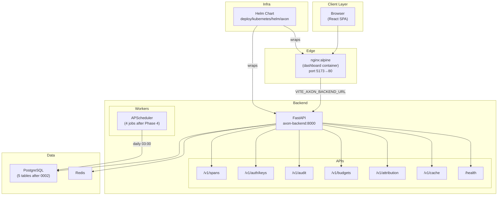
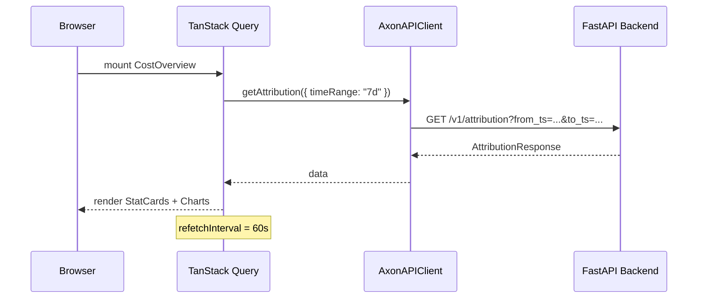
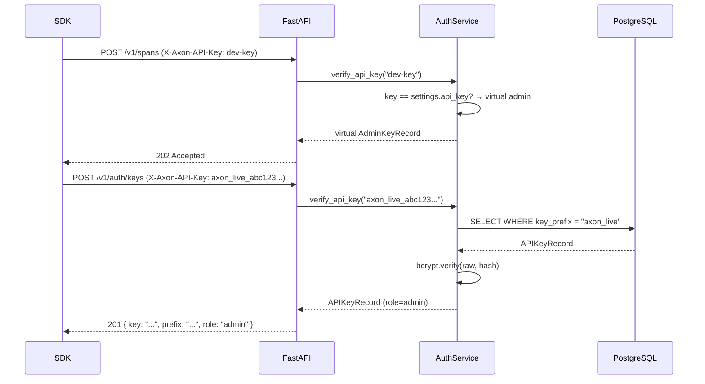
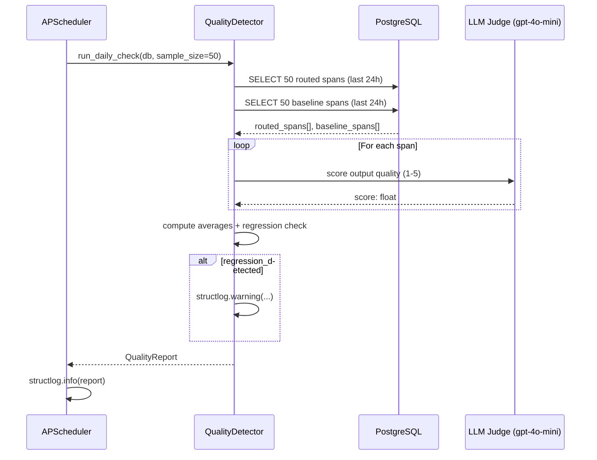

# Design Document: Axon Phase 4 — Custom React Dashboard, Kubernetes, Enterprise Features

## Overview

Phase 4 makes Axon production-ready and enterprise-adoptable. It adds a purpose-built React SPA
dashboard (replacing Grafana for cloud users), database-backed API key management with RBAC and
audit logging, an offline quality regression detector, a batch eligibility metadata tagger, a
Kubernetes Helm chart, and coverage improvements for Phase 3 gaps.

All Phase 1, 2, and 3 code remains untouched except for the narrow, explicitly listed additions
in `instrumentor.py`, `models.py`, `scheduler.py`, `docker-compose.yml`, `.env.example`,
`ci.yml`, and `README.md`. Every existing test continues to pass at every commit.

---

## 1. System Architecture



Phase 4 components and their integration points:

| Component | Touches existing code? | How |
|---|---|---|
| React Dashboard | No | New `dashboard/` directory; calls existing REST API |
| Enterprise Auth | No | New files in `api/v1/`, `models/`, `services/`; existing `verify_api_key` remains for backward compat |
| Quality Detector | Scheduler only | Adds one job to `scheduler.py` |
| Batch Tagger | `instrumentor.py` + `models.py` | Adds one field each |
| Helm Chart | No | New `deploy/kubernetes/` |
| Alembic 0002 | `migrations/versions/` | New file, new tables + one column |

---

## 2. Feature 1: Custom React Dashboard

### 2.1 Tech Stack

| Concern | Library | Version |
|---|---|---|
| UI framework | React | ^18.3.0 |
| Language | TypeScript | ^5.4.0 (strict: true) |
| Build tool | Vite | ^5.3.0 |
| Charts | Recharts | ^2.12.0 |
| Styling | Tailwind CSS | ^3.4.0 |
| Server state | TanStack Query v5 | ^5.40.0 |
| Routing | React Router | ^6.23.0 |
| Global state | Zustand | ^4.5.0 |
| Testing | Vitest + RTL | ^1.6.0 / ^16.0.0 |

No custom CSS files. Tailwind utility classes exclusively. No UI component libraries beyond
what is in `package.json`.

### 2.2 Directory Structure

```
dashboard/
├── src/
│   ├── main.tsx                  Entry point — mounts App into #root
│   ├── App.tsx                   Router setup, QueryClientProvider, store init
│   ├── api/
│   │   ├── client.ts             AxonAPIClient class
│   │   └── types.ts              All API response types (TypeScript interfaces)
│   ├── components/
│   │   ├── layout/
│   │   │   ├── Sidebar.tsx       Navigation links to all 5 pages
│   │   │   ├── Header.tsx        Page title + global time-range selector
│   │   │   └── Layout.tsx        Sidebar + Header + <Outlet />
│   │   └── ui/
│   │       ├── StatCard.tsx      KPI card with label, value, optional delta
│   │       ├── CostChart.tsx     Line chart — cost over time by feature_tag
│   │       ├── CompressionChart.tsx  Area + bar charts for compression stats
│   │       ├── BudgetGauge.tsx   Radial gauge showing pct_used
│   │       ├── RouterDecisionTable.tsx  Sortable table of routing events
│   │       └── SpanTable.tsx     Paginated span explorer table
│   ├── pages/
│   │   ├── CostOverview.tsx
│   │   ├── CompressionROI.tsx
│   │   ├── BudgetManager.tsx
│   │   ├── RouterAnalytics.tsx
│   │   └── SpanExplorer.tsx
│   ├── hooks/
│   │   ├── useAttribution.ts     useQuery wrapper for /v1/attribution
│   │   ├── useBudgets.ts         useQuery + useMutation wrappers for /v1/budgets
│   │   └── useSpans.ts           useQuery wrapper for /v1/spans with filters
│   └── lib/
│       ├── formatters.ts         formatTokens, formatCost, formatPct
│       └── constants.ts          TIME_RANGES, COLOR_PALETTE, DEFAULT_PAGE_SIZE
├── public/
│   └── index.html
├── Dockerfile                    Multi-stage: node:20-alpine → nginx:alpine
├── nginx.conf                    SPA routing + /api 404
├── package.json
├── tsconfig.json                 strict: true, no implicit any
├── vite.config.ts
├── tailwind.config.ts
├── postcss.config.js
└── index.html                    Vite entry HTML
```

### 2.3 API Client Design

```typescript
// dashboard/src/api/client.ts

export class AxonAPIError extends Error {
  constructor(
    public readonly status: number,
    message: string,
  ) {
    super(message);
    this.name = "AxonAPIError";
  }
}

export class AxonAPIClient {
  private readonly baseUrl: string;
  private readonly apiKey: string;

  constructor(baseUrl: string, apiKey: string) {
    this.baseUrl = baseUrl.replace(/\/$/, "");
    this.apiKey = apiKey;
  }

  // Attribution
  async getAttribution(params: AttributionParams): Promise<AttributionResponse>

  // Budgets
  async getBudgets(): Promise<BudgetStatus[]>
  async getBudget(featureTag: string): Promise<BudgetStatus>
  async upsertBudget(featureTag: string, payload: BudgetPayload): Promise<BudgetStatus>
  async deleteBudget(featureTag: string): Promise<void>

  // Spans
  async getSpans(params: SpanQueryParams): Promise<InferenceSpanResponse[]>

  // Cache
  async getCacheStats(featureTag?: string): Promise<CacheStats>

  // Health
  async getHealth(): Promise<HealthStatus>

  // Private helper — throws AxonAPIError on non-2xx
  private async request<T>(path: string, options?: RequestInit): Promise<T>
}
```

All methods throw `AxonAPIError` on non-2xx. Never return `undefined` — throw on error.
The `X-Axon-API-Key` header is added automatically by the `request` helper.

### 2.4 Global State (Zustand)

```typescript
// Two stores only — no over-engineering

interface AppStore {
  apiKey: string;
  setApiKey: (key: string) => void;
  timeRange: "24h" | "7d" | "30d";
  setTimeRange: (range: "24h" | "7d" | "30d") => void;
}
```

`apiKey` defaults to `import.meta.env.VITE_AXON_API_KEY`. `timeRange` defaults to `"7d"`.

### 2.5 Page Specifications

#### CostOverview.tsx
- Time range selector: 24h / 7d / 30d (top right, updates Zustand + invalidates queries)
- Row 1 stats: total cost, total tokens, cache hit rate, tokens saved by compression
- Row 2 charts: cost over time (line, grouped by `feature_tag`), cost by model (bar), cost by provider (donut)
- Row 3: top-10 feature tags by cost — sortable table with `feature_tag`, `total_cost_usd`, `call_count`, `avg_cost`
- Auto-refresh every 60 s via `refetchInterval: 60_000`

#### CompressionROI.tsx
- Stats: total tokens saved, total cost saved, avg compression ratio, shadow vs live mode split
- Charts: tokens saved over time (area), compression ratio by feature_tag (horizontal bar), cache hit rate over time (line)
- Cumulative cost saved by semantic cache: stat card

#### BudgetManager.tsx
- Table: `feature_tag`, `budget_usd`, `period`, `spent_usd`, `remaining_usd`, `pct_used`, status badge
- Status badge colors: green (`ok`, < 80%), yellow (`warning`, 80–100%), red (`exhausted`, ≥ 100%)
- Add/edit budget: inline form below table, no modal
- Delete: inline confirmation row
- Budget gauges: one `BudgetGauge` per feature tag below the table

#### RouterAnalytics.tsx
- Routing decisions table: `timestamp`, `original_model`, `selected_model`, `task_type`, `complexity_tier`, `cost_delta_pct`
- Donut chart: model distribution by tier
- Stat card: cumulative cost savings from routing
- Bar chart: task type breakdown

#### SpanExplorer.tsx
- Filters: `feature_tag`, `model`, `provider`, `environment`, date range, `compression_applied`
- Table columns: `timestamp`, `model`, `input_tokens`, `output_tokens`, `cost_usd`, `feature_tag`, `compression_applied`, `cache_hit`
- Pagination: 50 rows/page via `limit`/`offset`
- Row expand: shows `prompt_hash`, `artifact_type`, `routing_decision`, `tokens_saved`, `batch_eligible`

### 2.6 Color Palette

```typescript
// dashboard/src/lib/constants.ts
export const COLORS = {
  bgPrimary:   "bg-gray-950",
  bgSecondary: "bg-gray-900",
  bgCard:      "bg-gray-800",
  border:      "border-gray-700",
  textPrimary: "text-gray-100",
  textMuted:   "text-gray-400",
  accent:      "text-teal-400",
  accentBg:    "bg-teal-500",
  success:     "text-green-400",
  warning:     "text-yellow-400",
  error:       "text-red-400",
  chartPrimary: "#2dd4bf",   // teal-400 hex for Recharts
} as const;
```

### 2.7 Formatters

```typescript
// dashboard/src/lib/formatters.ts

/** Format token count with comma separators. e.g. 1234567 → "1,234,567" */
export function formatTokens(n: number): string

/** Format USD cost with 6 decimal places for small values, 2 for large. */
export function formatCost(usd: string | number): string

/** Format percentage, rounded to 1 decimal place. e.g. 0.8234 → "82.3%" */
export function formatPct(ratio: number): string
```

### 2.8 Docker Setup

```dockerfile
# dashboard/Dockerfile
FROM node:20-alpine AS builder
WORKDIR /app
COPY package.json .
RUN npm install
COPY . .
RUN npm run build

FROM nginx:alpine
COPY --from=builder /app/dist /usr/share/nginx/html
COPY nginx.conf /etc/nginx/conf.d/default.conf
EXPOSE 80
```

```nginx
# dashboard/nginx.conf
server {
  listen 80;
  root /usr/share/nginx/html;
  index index.html;
  location / {
    try_files $uri $uri/ /index.html;
  }
  location /api {
    return 404;
  }
}
```

### 2.9 Sequence Diagram — CostOverview load



---

## 3. Feature 2: Enterprise Auth

### 3.1 Database Schema

```python
# backend/axon_backend/models/api_key.py

class APIKeyRecord(Base):
    __tablename__ = "api_keys"

    id: Mapped[uuid.UUID]          # PK, server_default gen_random_uuid()
    name: Mapped[str]              # human label: "production", "ci-runner"
    key_hash: Mapped[str]          # bcrypt hash of the raw key
    key_prefix: Mapped[str]        # first 8 chars — indexed, for identification
    role: Mapped[str]              # "admin" | "engineer" | "viewer"
    created_at: Mapped[datetime]   # server_default now()
    last_used_at: Mapped[datetime | None]
    expires_at: Mapped[datetime | None]
    revoked: Mapped[bool]          # server_default false
    created_by: Mapped[str]        # key_prefix of creator; "system" for seed key
```

```python
# backend/axon_backend/models/audit_log.py

class AuditLogRecord(Base):
    __tablename__ = "audit_log"

    id: Mapped[uuid.UUID]          # PK
    timestamp: Mapped[datetime]    # indexed
    actor_key_prefix: Mapped[str]  # identifies who performed the action
    action: Mapped[str]            # "span.ingest" | "budget.upsert" | "key.create" | ...
    resource: Mapped[str]          # feature_tag or "*" for system-level actions
    result: Mapped[str]            # "success" | "denied" | "error"
    ip_address: Mapped[str]
    details: Mapped[str | None]    # JSON string of relevant params
```

Audit log is append-only. No `UPDATE` or `DELETE` SQL is ever issued against this table.

### 3.2 Auth Service Design

```python
# backend/axon_backend/services/auth_service.py

ROLE_ORDER: dict[str, int] = {"viewer": 0, "engineer": 1, "admin": 2}

def generate_api_key() -> tuple[str, str]:
    """Generate (raw_key, bcrypt_hash).
    raw_key format: axon_live_{32 random hex chars}
    Never store raw_key — caller must hash immediately.
    """

async def verify_api_key(
    raw_key: str,
    db: AsyncSession,
) -> APIKeyRecord | None:
    """Look up key by prefix, bcrypt-verify against stored hash.
    Returns APIKeyRecord if valid, not revoked, not expired.
    Updates last_used_at on success (fire-and-forget, never raises).
    Returns None on any failure — never leaks reason.
    """

def require_role(minimum_role: str) -> Callable[..., Coroutine[Any, Any, APIKeyRecord]]:
    """FastAPI dependency factory. Returns a Depends-compatible async function.
    Reads X-Axon-API-Key header, calls verify_api_key, checks role >= minimum_role.
    Raises 401 if key missing/invalid, 403 if role insufficient.
    """
```

Role hierarchy: `viewer (0) < engineer (1) < admin (2)`. A `require_role("engineer")` dependency
accepts both `engineer` and `admin` keys.

### 3.3 Backward Compatibility

The existing `verify_api_key` dependency in `spans.py` continues to work as-is.
The env-var key (`settings.api_key`) is treated as a virtual admin key: if a request
presents the env-var value, it is accepted with `admin` role without a DB lookup.
This allows existing SDK integrations to keep working without changes.



### 3.4 API Endpoints

```
POST   /v1/auth/keys          requires: admin
GET    /v1/auth/keys          requires: admin
DELETE /v1/auth/keys/{prefix} requires: admin

GET    /v1/audit              requires: admin
```

Response shapes:

```typescript
// POST /v1/auth/keys — body
{ name: string; role: "admin" | "engineer" | "viewer"; expires_in_days: number | null }

// POST /v1/auth/keys — response (raw key shown ONCE)
{ key: string; prefix: string; role: string; name: string; created_at: string }

// GET /v1/auth/keys — response
{ prefix: string; name: string; role: string; created_at: string;
  last_used_at: string | null; expires_at: string | null; revoked: boolean }[]

// GET /v1/audit — query params
{ from_ts?: string; to_ts?: string; actor_prefix?: string; action?: string; limit?: number }

// GET /v1/audit — response
{ id: string; timestamp: string; actor_key_prefix: string; action: string;
  resource: string; result: string; ip_address: string; details: string | null }[]
```

### 3.5 Audit Service Design

```python
# backend/axon_backend/services/audit_service.py

async def append_log(
    db: AsyncSession,
    actor_key_prefix: str,
    action: str,
    resource: str,
    result: str,
    ip_address: str,
    details: dict[str, Any] | None = None,
) -> None:
    """Insert one AuditLogRecord. Never raises — errors are logged only."""
```

`append_log` is called as a fire-and-forget after every auth mutation. It never blocks
the response path. If it fails, the failure is logged via structlog; the original
response is returned unchanged.

---

## 4. Feature 3: Quality Regression Detector

### 4.1 Design Principle

Completely offline. Never runs on the inference path. Never makes synchronous calls during
an API request. The APScheduler job runs at 03:00 UTC daily and is the only entry point.

### 4.2 Data Classes

```python
# backend/axon_backend/services/quality_detector.py

@dataclass
class QualityReport:
    date: datetime
    spans_sampled: int
    routed_avg_quality: float
    baseline_avg_quality: float
    regression_detected: bool
    regression_threshold: float  # default 0.3
    details: list[dict[str, Any]]
```

### 4.3 QualityDetector Class

```python
class QualityDetector:
    REGRESSION_THRESHOLD: float = 0.3
    DEFAULT_SAMPLE_SIZE: int = 50
    JUDGE_MODELS: list[str] = ["gpt-4o-mini", "claude-haiku-20240307"]

    async def run_daily_check(
        self,
        db: AsyncSession,
        sample_size: int = DEFAULT_SAMPLE_SIZE,
    ) -> QualityReport:
        """
        1. SELECT up to sample_size spans from last 24h WHERE
           routing_decision IS NOT NULL (routed spans)
           + up to sample_size spans WHERE routing_decision IS NULL (baseline)
        2. For each span, call _score_quality() → float 1.0–5.0
        3. Compute routed_avg and baseline_avg
        4. regression_detected = routed_avg < baseline_avg - REGRESSION_THRESHOLD
        5. If regression: log warning with structlog
        6. Return QualityReport (never raises)
        """

    async def _score_quality(
        self,
        span: InferenceSpanRecord,
        judge_model: str,
    ) -> float:
        """Call the LLM judge. Returns score 1.0–5.0.
        On any error: returns 3.0 (neutral) and logs warning.
        """
```

### 4.4 Sequence Diagram



### 4.5 Scheduler Integration

```python
# Addition to backend/axon_backend/workers/scheduler.py

async def _run_quality_check() -> None:
    try:
        from axon_backend.services.quality_detector import QualityDetector
        detector = QualityDetector()
        async with AsyncSessionLocal() as db:
            report = await detector.run_daily_check(db)
        _log.info(
            "axon.worker.quality_check.done",
            regression_detected=report.regression_detected,
            routed_avg=report.routed_avg_quality,
            baseline_avg=report.baseline_avg_quality,
            spans_sampled=report.spans_sampled,
        )
    except Exception as exc:
        _log.error("axon.worker.quality_check.error", error=str(exc))

# In register_jobs():
scheduler.add_job(
    _run_quality_check,
    trigger="cron",
    hour=3,
    minute=0,
    id="quality_check",
    replace_existing=True,
)
```

---

## 5. Feature 4: Batch Eligibility Tagger

### 5.1 Minimal Change Principle

This feature adds exactly one field to `InferenceSpan` (the Pydantic model) and one field to
`InferenceSpanRecord` (the ORM model). The `instrument()` and `patch()` functions gain one
optional parameter. No other behavior changes.

### 5.2 SDK Changes

```python
# sdk/python/axon/models.py — ADD ONE FIELD ONLY
class InferenceSpan(BaseModel):
    # ... all existing fields unchanged ...
    batch_eligible: bool = False   # NEW — Phase 4 addition
```

```python
# sdk/python/axon/core/instrumentor.py — ADD ONE PARAMETER ONLY

def instrument(
    feature_tag: str = "default",
    shadow_mode: bool = True,
    strategy: CompressionStrategy = CompressionStrategy.CONSERVATIVE,
    environment: str = "production",
    batch_eligible: bool | None = None,   # NEW — Phase 4 addition
) -> Callable[..., Any]:
    """... existing docstring plus:
    Args:
        batch_eligible: When True, marks the span as eligible for batch
            API submission. When None (default), auto-detected from the
            AXON_BATCH_ELIGIBLE_FEATURES environment variable. When False,
            explicitly opts out regardless of env var.
    """
```

Auto-detection logic in `_run_pipeline`:

```python
import os as _os

def _resolve_batch_eligible(
    feature_tag: str,
    explicit: bool | None,
) -> bool:
    """Resolve batch eligibility.
    
    If explicit is True or False → return it directly.
    If explicit is None → check AXON_BATCH_ELIGIBLE_FEATURES env var.
      - Parse as comma-separated feature tags (strip whitespace).
      - Return True if feature_tag is in the list, False otherwise.
    """
    if explicit is not None:
        return explicit
    env_val = _os.environ.get("AXON_BATCH_ELIGIBLE_FEATURES", "")
    eligible_tags = {t.strip() for t in env_val.split(",") if t.strip()}
    return feature_tag in eligible_tags
```

The resolved value is passed into the `InferenceSpan` constructor in `_run_pipeline`.
`patch()` gains the same `batch_eligible: bool | None = None` parameter and forwards it.

### 5.3 Backend DB Addition

```python
# backend/axon_backend/models/span.py — ADD ONE COLUMN ONLY
batch_eligible: Mapped[bool] = mapped_column(
    nullable=False, server_default=text("false")
)
```

The `InferenceSpanPayload` in `span_ingestion.py` is a Phase 2 file and **cannot be modified**.
The migration handles the schema change; existing rows default to `false`.

---

## 6. Kubernetes / Helm Chart

### 6.1 Chart Structure

```
deploy/kubernetes/helm/axon/
├── Chart.yaml
├── values.yaml
└── templates/
    ├── _helpers.tpl              named templates: axon.labels, axon.selectorLabels
    ├── deployment-backend.yaml   2 replicas, readiness + liveness on GET /health
    ├── deployment-dashboard.yaml 1 replica
    ├── service-backend.yaml      ClusterIP, port 8000
    ├── service-dashboard.yaml    ClusterIP, port 80
    ├── configmap.yaml            CORS_ORIGINS, API_HOST, API_PORT, etc.
    ├── secret.yaml               DATABASE_URL, REDIS_URL, API_KEY (base64)
    ├── ingress.yaml              optional, off by default (ingress.enabled: false)
    ├── pvc-postgres.yaml         20Gi ReadWriteOnce
    └── pvc-redis.yaml            2Gi ReadWriteOnce
```

### 6.2 Probe Design

```yaml
# deployment-backend.yaml (excerpt)
livenessProbe:
  httpGet:
    path: /health
    port: 8000
  initialDelaySeconds: 15
  periodSeconds: 20
  failureThreshold: 3

readinessProbe:
  httpGet:
    path: /health
    port: 8000
  initialDelaySeconds: 5
  periodSeconds: 10
  failureThreshold: 3
```

The backend `/health` endpoint already exists and returns `{"status":"ok","version":"..."}`.

### 6.3 Named Template Pattern

```yaml
# templates/_helpers.tpl
{{- define "axon.labels" -}}
helm.sh/chart: {{ .Chart.Name }}-{{ .Chart.Version }}
app.kubernetes.io/name: {{ .Chart.Name }}
app.kubernetes.io/version: {{ .Chart.AppVersion }}
app.kubernetes.io/managed-by: {{ .Release.Service }}
{{- end }}

{{- define "axon.selectorLabels" -}}
app.kubernetes.io/name: {{ .Chart.Name }}
app.kubernetes.io/instance: {{ .Release.Name }}
{{- end }}
```

### 6.4 values.yaml Structure

```yaml
backend:
  replicaCount: 2
  image: ghcr.io/aarohim24/axon-backend:latest
  resources:
    requests: { cpu: 250m, memory: 512Mi }
    limits:   { cpu: 500m, memory: 1Gi }

dashboard:
  replicaCount: 1
  image: ghcr.io/aarohim24/axon-dashboard:latest
  resources:
    requests: { cpu: 100m, memory: 128Mi }
    limits:   { cpu: 200m, memory: 256Mi }

postgres:
  enabled: true
  storageSize: 20Gi

redis:
  enabled: true
  storageSize: 2Gi

ingress:
  enabled: false
  host: ""
```

---

## 7. Database Migration (0002)

```python
# backend/migrations/versions/0002_phase4_schema.py
# revision: "0002"
# down_revision: "0001"

def upgrade() -> None:
    # Table: api_keys
    op.create_table(
        "api_keys",
        sa.Column("id", sa.UUID(), server_default=sa.text("gen_random_uuid()"),
                  primary_key=True, nullable=False),
        sa.Column("name", sa.String(), nullable=False),
        sa.Column("key_hash", sa.String(), nullable=False),
        sa.Column("key_prefix", sa.String(16), nullable=False, unique=True),
        sa.Column("role", sa.String(16), nullable=False),
        sa.Column("created_at", sa.DateTime(timezone=True),
                  server_default=sa.text("now()"), nullable=False),
        sa.Column("last_used_at", sa.DateTime(timezone=True), nullable=True),
        sa.Column("expires_at", sa.DateTime(timezone=True), nullable=True),
        sa.Column("revoked", sa.Boolean(), server_default=sa.text("false"), nullable=False),
        sa.Column("created_by", sa.String(16), nullable=False),
    )
    op.create_index("ix_api_keys_prefix", "api_keys", ["key_prefix"])

    # Table: audit_log
    op.create_table(
        "audit_log",
        sa.Column("id", sa.UUID(), server_default=sa.text("gen_random_uuid()"),
                  primary_key=True, nullable=False),
        sa.Column("timestamp", sa.DateTime(timezone=True),
                  server_default=sa.text("now()"), nullable=False),
        sa.Column("actor_key_prefix", sa.String(16), nullable=False),
        sa.Column("action", sa.String(), nullable=False),
        sa.Column("resource", sa.String(), nullable=False),
        sa.Column("result", sa.String(16), nullable=False),
        sa.Column("ip_address", sa.String(45), nullable=False),
        sa.Column("details", sa.Text(), nullable=True),
    )
    op.create_index("ix_audit_log_timestamp", "audit_log", ["timestamp"])
    op.create_index("ix_audit_log_actor", "audit_log", ["actor_key_prefix"])

    # Column: inference_spans.batch_eligible
    op.add_column(
        "inference_spans",
        sa.Column("batch_eligible", sa.Boolean(),
                  server_default=sa.text("false"), nullable=False),
    )

def downgrade() -> None:
    op.drop_column("inference_spans", "batch_eligible")
    op.drop_table("audit_log")
    op.drop_table("api_keys")
```

---

## 8. Coverage Improvements (Phase 3 Gaps)

### 8.1 backend_client.py (currently 0%)

Test file: `sdk/python/tests/unit/test_backend_client.py`

Use `respx` to mock HTTP transport. Key test cases:

| Test | What it validates |
|---|---|
| `test_send_span_fires_post` | POST to `/v1/spans` with correct payload |
| `test_send_span_fire_and_forget` | Response is None, does not raise |
| `test_check_budget_ok` | Returns `BudgetStatus` with `allowed=True` |
| `test_check_budget_fail_open_on_error` | Returns `allowed=True` when backend returns 500 |
| `test_check_budget_fail_open_on_timeout` | Returns `allowed=True` when request times out |

### 8.2 cache/semantic_cache.py (currently 0%)

Test file: `sdk/python/tests/unit/test_semantic_cache.py`

Mock the `BackendClient`. Key test cases:

| Test | What it validates |
|---|---|
| `test_lookup_returns_none_on_miss` | None when no cache hit |
| `test_store_fires_and_forgets` | store() does not raise |
| `test_lookup_fail_open_on_backend_error` | Returns None (not raises) |
| `test_store_fail_open_on_backend_error` | Does not raise on backend error |

### 8.3 cascade_tracer.py (currently 65%)

Test file: `sdk/python/tests/unit/test_cascade_tracer.py` (additions only)

| Test | What it validates |
|---|---|
| `test_get_cascade_cost_returns_summary` | Returns `CascadeCostSummary` with correct totals |
| `test_get_cascade_cost_empty_on_backend_error` | Returns empty summary on backend error |

---

## 9. 25-Commit Sequence — File Map

| # | Commit | Files Created | Files Modified |
|---|---|---|---|
| 01 | feat(backend): add api_key and audit_log models | `models/api_key.py`, `models/audit_log.py` | — |
| 02 | feat(backend): implement auth service | `services/auth_service.py` | — |
| 03 | feat(backend): implement audit service | `services/audit_service.py` | — |
| 04 | feat(backend): add auth and audit API endpoints | `api/v1/auth.py`, `api/v1/audit.py` | — |
| 05 | feat(backend): add Alembic migration 0002 | `migrations/versions/0002_phase4_schema.py` | — |
| 06 | test(backend): add auth service and API tests | `tests/unit/test_auth_service.py`, `tests/integration/test_auth_api.py`, `tests/unit/test_audit_service.py` | — |
| 07 | feat(sdk): add batch eligibility tagger | — | `sdk/python/axon/models.py`, `sdk/python/axon/core/instrumentor.py` |
| 08 | feat(backend): add quality regression detector service | `services/quality_detector.py` | — |
| 09 | feat(backend): add quality check APScheduler job | — | `workers/scheduler.py` |
| 10 | test(sdk): add coverage for backend_client, semantic_cache, cascade_tracer | `tests/unit/test_backend_client.py`, `tests/unit/test_semantic_cache.py` | `tests/unit/test_cascade_tracer.py` |
| 11 | feat(dashboard): initialize React + Vite + Tailwind | `dashboard/package.json`, `dashboard/tsconfig.json`, `dashboard/vite.config.ts`, `dashboard/tailwind.config.ts`, `dashboard/postcss.config.js`, `dashboard/index.html`, `dashboard/src/main.tsx`, `dashboard/src/App.tsx`, `dashboard/src/lib/constants.ts`, `dashboard/src/lib/formatters.ts` | — |
| 12 | feat(dashboard): implement API client | `dashboard/src/api/client.ts`, `dashboard/src/api/types.ts` | — |
| 13 | feat(dashboard): implement layout | `dashboard/src/components/layout/Sidebar.tsx`, `dashboard/src/components/layout/Header.tsx`, `dashboard/src/components/layout/Layout.tsx` | — |
| 14 | feat(dashboard): implement CostOverview | `dashboard/src/pages/CostOverview.tsx`, `dashboard/src/components/ui/StatCard.tsx`, `dashboard/src/components/ui/CostChart.tsx`, `dashboard/src/hooks/useAttribution.ts` | — |
| 15 | feat(dashboard): implement CompressionROI | `dashboard/src/pages/CompressionROI.tsx`, `dashboard/src/components/ui/CompressionChart.tsx` | — |
| 16 | feat(dashboard): implement BudgetManager | `dashboard/src/pages/BudgetManager.tsx`, `dashboard/src/components/ui/BudgetGauge.tsx`, `dashboard/src/hooks/useBudgets.ts` | — |
| 17 | feat(dashboard): implement RouterAnalytics | `dashboard/src/pages/RouterAnalytics.tsx`, `dashboard/src/components/ui/RouterDecisionTable.tsx` | — |
| 18 | feat(dashboard): implement SpanExplorer | `dashboard/src/pages/SpanExplorer.tsx`, `dashboard/src/components/ui/SpanTable.tsx`, `dashboard/src/hooks/useSpans.ts` | — |
| 19 | test(dashboard): add Vitest tests | `dashboard/src/tests/CostOverview.test.tsx`, `dashboard/src/tests/BudgetManager.test.tsx`, `dashboard/src/tests/formatters.test.ts` | `dashboard/vite.config.ts` |
| 20 | feat(deploy): add dashboard to Docker Compose | `dashboard/Dockerfile`, `dashboard/nginx.conf` | `deploy/docker-compose.yml`, `deploy/.env.example` |
| 21 | feat(deploy): add Kubernetes Helm chart | `deploy/kubernetes/helm/axon/Chart.yaml`, `deploy/kubernetes/helm/axon/values.yaml`, `deploy/kubernetes/helm/axon/templates/_helpers.tpl`, `deploy/kubernetes/helm/axon/templates/deployment-backend.yaml`, `deploy/kubernetes/helm/axon/templates/deployment-dashboard.yaml`, `deploy/kubernetes/helm/axon/templates/service-backend.yaml`, `deploy/kubernetes/helm/axon/templates/service-dashboard.yaml`, `deploy/kubernetes/helm/axon/templates/configmap.yaml`, `deploy/kubernetes/helm/axon/templates/secret.yaml`, `deploy/kubernetes/helm/axon/templates/ingress.yaml`, `deploy/kubernetes/helm/axon/templates/pvc-postgres.yaml`, `deploy/kubernetes/helm/axon/templates/pvc-redis.yaml`, `deploy/kubernetes/README.md` | — |
| 22 | ci: add dashboard-test and helm-lint | — | `.github/workflows/ci.yml` |
| 23 | docs: dashboard guide, enterprise auth, k8s | `docs/dashboard-guide.md`, `docs/enterprise-auth.md`, `docs/kubernetes-deployment.md` | — |
| 24 | docs: update README | — | `README.md` |
| 25 | chore: Phase 4 complete | — | — |

---

## 10. Correctness Properties

### 10.1 Auth — Key Generation Format

**Property (Hypothesis)**:
```python
@given(st.nothing())  # parameterized via @settings
def test_api_key_format_always_valid():
    """For any generated key: prefix = raw_key[:8], format = axon_live_{32 hex}"""
    raw_key, key_hash = generate_api_key()
    assert raw_key.startswith("axon_live_")
    assert len(raw_key) == len("axon_live_") + 32
    assert all(c in "0123456789abcdef" for c in raw_key[len("axon_live_"):])
    assert raw_key[:8] == raw_key[:8]  # prefix is deterministic
```

**Property**: `∀ key ∈ generate_api_key(): key.startswith("axon_live_") ∧ len(key) == 42`

### 10.2 Auth — Bcrypt Determinism

**Property**: `∀ raw_key: verify(raw_key, hash(raw_key)) = True`
**Property**: `∀ raw_key, wrong_key: raw_key ≠ wrong_key → verify(wrong_key, hash(raw_key)) = False`

### 10.3 Auth — Role Hierarchy

**Property (fast-check / Hypothesis)**:
```
∀ role ∈ {viewer, engineer, admin}:
  require_role("viewer")  accepts role
  require_role("engineer") accepts role if ROLE_ORDER[role] >= 1
  require_role("admin")    accepts role only if role == "admin"
```

### 10.4 Quality Detector — Regression Threshold

**Property**:
```
∀ routed_avg, baseline_avg, threshold:
  regression_detected ↔ routed_avg < baseline_avg - threshold
```

Specifically:
- If `routed_avg = 3.5, baseline_avg = 3.8, threshold = 0.3`: `regression_detected = False` (3.5 ≥ 3.8 - 0.3 = 3.5)
- If `routed_avg = 3.4, baseline_avg = 3.8, threshold = 0.3`: `regression_detected = True` (3.4 < 3.5)
- If `spans_sampled = 0`: `regression_detected = False` (no data — no regression)

### 10.5 Batch Tagger — Env Var Parsing

**Property (Hypothesis)**:
```python
@given(
    feature_tag=st.text(min_size=1),
    env_tags=st.lists(st.text(min_size=1), min_size=0, max_size=10),
)
def test_batch_eligible_env_resolution(feature_tag, env_tags):
    """batch_eligible is True iff feature_tag is in the parsed env var list."""
    env_val = ",".join(env_tags)
    result = _resolve_batch_eligible(feature_tag, explicit=None)
    # with env mocked to env_val:
    assert result == (feature_tag in {t.strip() for t in env_val.split(",") if t.strip()})
```

**Property**: `explicit=True` always overrides env var: `_resolve_batch_eligible(any_tag, True) = True`
**Property**: `explicit=False` always overrides env var: `_resolve_batch_eligible(any_tag, False) = False`

### 10.6 Dashboard Formatters

**Property (Vitest)**:
```typescript
// formatTokens
∀ n: number where n >= 0: formatTokens(n).replace(/,/g, "") === String(n)
∀ n: number where n >= 1000: formatTokens(n).includes(",")

// formatCost
∀ cost: number where cost < 0.01: formatCost(cost).split(".")[1].length === 6
∀ cost: number where cost >= 1.0: formatCost(cost).split(".")[1].length === 2

// formatPct
∀ ratio: number where 0 <= ratio <= 1: 
  parseFloat(formatPct(ratio)) >= 0 && parseFloat(formatPct(ratio)) <= 100
```
