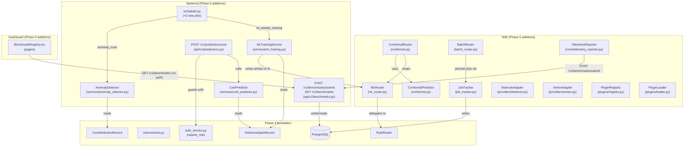
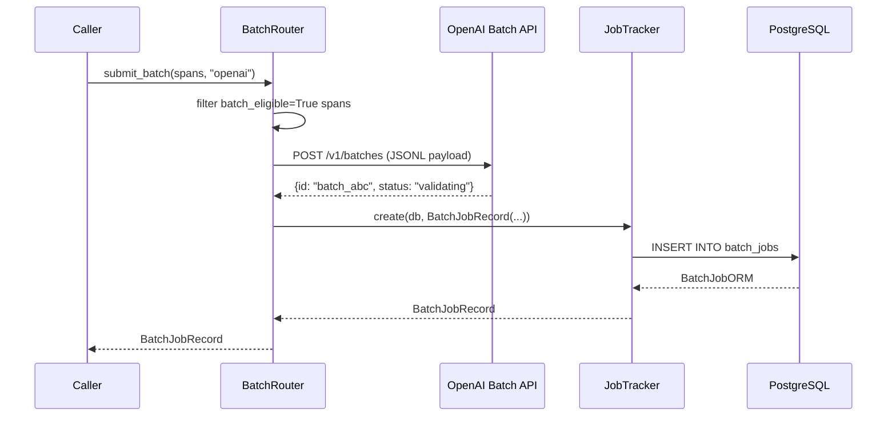
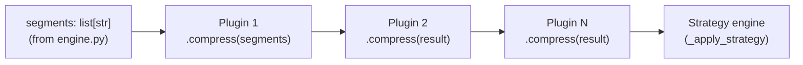

# Design Document: Axon Phase 5 — Differentiation & Scale

## Overview

Phase 5 delivers two parallel tracks on top of the fully validated Phase 4 platform.

**Track A** adds seven technical capabilities: ML-based model routing with conformal
prediction quality guarantees (`MLRouter`, `ConformalPredictor`, `ConformalRouter`), batch
routing integration with OpenAI and Anthropic batch APIs (`BatchRouter`, `JobTracker`),
provider expansion to AWS Bedrock and Google Vertex AI (`BedrockAdapter`, `VertexAdapter`),
a plugin system for custom compression/routing/classification logic (`PluginRegistry`,
`PluginLoader`), predictive cost modeling (`CostPredictor`), and IQR-based anomaly detection
(`AnomalyDetector`).

**Track B** adds five credibility and community deliverables: opt-in production telemetry
collection (`TelemetryReporter`), a public benchmark registry dashboard page
(`BenchmarkRegistry`), community governance infrastructure, a contributor setup script,
and an arXiv-ready technical paper skeleton with honest evaluation placeholders.

All 481 existing tests continue to pass at every commit. Phase 1–4 code is untouched except
for the narrow, explicitly listed additions to `scheduler.py`, the new migration `0003`, and
the new API router entries in `api/v1/router.py`.

---

## Architecture

## Components and Interfaces

See detailed component designs in sections 2–13 below.

### How Phase 5 Integrates with Phase 4



### Track A Component Map

| Component | New file(s) | Phase 4 touchpoints |
|---|---|---|
| MLRouter | `sdk/python/axon/router/ml_router.py` | Reads `RoutingDecision`, `RuleRouter` |
| ConformalPredictor / ConformalRouter | `sdk/python/axon/router/conformal.py` | Wraps any router implementing `route()` |
| MLTrainingService | `backend/axon_backend/services/ml_training.py` | Reads `InferenceSpanRecord` |
| BatchRouter | `sdk/python/axon/batch/batch_router.py` | Reads `InferenceSpan.batch_eligible` |
| JobTracker | `sdk/python/axon/batch/job_tracker.py` | New PostgreSQL table via migration 0003 |
| BedrockAdapter | `sdk/python/axon/providers/bedrock.py` | Returns `ProviderResponse` |
| VertexAdapter | `sdk/python/axon/providers/vertex.py` | Returns `ProviderResponse` |
| PluginRegistry | `sdk/python/axon/plugins/registry.py` | Called by compression engine pipeline |
| PluginLoader | `sdk/python/axon/plugins/loader.py` | Uses `importlib.metadata` |
| CostPredictor | `backend/axon_backend/services/cost_predictor.py` | Reads `InferenceSpanRecord`, pricing table |
| AnomalyDetector | `backend/axon_backend/services/anomaly_detector.py` | Reads `CostAttributionRecord` |
| APScheduler (2 new jobs) | `backend/axon_backend/workers/scheduler.py` | Adds to existing `register_jobs()` |

### Track B Component Map

| Component | New file(s) | Phase 4 touchpoints |
|---|---|---|
| TelemetryReporter | `sdk/python/axon/core/telemetry_reporter.py` | None (standalone, disabled by default) |
| BenchmarkRegistry backend | `backend/axon_backend/api/v1/benchmarks.py` | New `BenchmarkRecord` ORM model |
| BenchmarkRegistry page | `dashboard/src/pages/BenchmarkRegistry.tsx` | Existing layout, Tailwind |
| Community docs | `community/GOVERNANCE.md`, `community/RFC_TEMPLATE.md`, `community/scripts/setup_contributor.sh` | None |
| Research artifacts | `docs/axon_paper.md`, `notebooks/compression_analysis.ipynb` | None |
| Launch docs | `docs/launch/HN_LAUNCH.md` | None |

---

## 2. MLRouter Design

The logistic regression model is trained on a 10-dimensional feature vector extracted from
the message list and the routing context. Features are computed by
`MLTrainingService._extract_features()` and must be identical at train time and inference
time.

| Index | Feature | Encoding | Notes |
|---|---|---|---|
| 0–9 | `task_type` one-hot | 10 binary floats | Covers all 10 `TaskType` values |
| 10 | `complexity_score` | raw float, no scaling | Already in [0, 1] |
| 11 | `input_token_count` normalized | `tokens / 8000.0`, clipped to [0, 1] | Matches `estimate_complexity` normalization |
| 12 | `has_code_blocks` | 1.0 / 0.0 | True if any message contains ` ``` ` |
| 13 | `has_tool_calls` | 1.0 / 0.0 | True if any message has role `"tool"` |
| 14–15 | `hour_of_day` cyclic | `[sin(2π·h/24), cos(2π·h/24)]` | Derived from span `timestamp` UTC hour |
| 16–17 | `day_of_week` cyclic | `[sin(2π·d/7), cos(2π·d/7)]` | Derived from span `timestamp` weekday |

Total dimensionality: **18 features**.

The one-hot encoding order follows `list(TaskType)` — fixed at training time and written into
the `MLModelArtifact.feature_names` list so inference always uses the same order.

### 2.2 MLModelArtifact Dataclass

```python
# sdk/python/axon/router/ml_router.py

@dataclass
class MLModelArtifact:
    """Serialized trained logistic regression routing model.

    Attributes:
        coefficients: 2D list shape [n_classes, n_features] — the LR weights.
        intercept: 1D list length n_classes — the LR bias terms.
        classes: List of ModelTier string values in the order sklearn assigns.
        feature_names: Ordered list of feature names (length 18).
        training_sample_count: Number of labeled examples used for training.
        trained_at: UTC timestamp of when training completed.
    """
    coefficients: list[list[float]]
    intercept: list[float]
    classes: list[str]
    feature_names: list[str]
    training_sample_count: int
    trained_at: datetime
```

Serialization is JSON only. `MLModelArtifact` is written/read via `json.dump` /
`json.load`. No `pickle` is used for the artifact itself (only `ConformalPredictor`
uses pickle for its own calibration state — see §3). The artifact path defaults to
`/tmp/axon_ml_model.json` and is configurable via the `AXON_ML_MODEL_PATH` environment
variable.

At inference time the `MLRouter` reconstructs a `sklearn.linear_model.LogisticRegression`
object from `coefficients`, `intercept`, and `classes` by setting the corresponding
attributes directly after construction with `warm_start=False`. This avoids having to
re-train and allows the serialized JSON to be the single source of truth.

### 2.3 MLRouter Class

```python
# sdk/python/axon/router/ml_router.py

class MLRouter:
    """ML-based model router using logistic regression.

    Falls back to RuleRouter when the training artifact contains fewer than
    500 examples, when no artifact is loaded, or when any exception occurs
    during inference.

    Args:
        provider: Provider name forwarded to the fallback RuleRouter.
        rule_router: Injected RuleRouter instance used as fallback.
        model_artifact_path: Optional path to a pre-trained MLModelArtifact
            JSON file. When None, the router starts in fallback mode.
        routing_table: Optional custom routing table forwarded to rule_router.
        model_map: Optional custom model map forwarded to rule_router.

    Raises:
        AxonDependencyError: If sklearn is not installed.
    """
    MIN_TRAINING_SAMPLES: int = 500

    def __init__(
        self,
        provider: str,
        rule_router: RuleRouter | None = None,
        model_artifact_path: str | None = None,
        routing_table: dict[TaskType, dict[ComplexityTier, ModelTier]] | None = None,
        model_map: dict[str, dict[ModelTier, str]] | None = None,
    ) -> None: ...

    def route(
        self,
        messages: list[dict[str, Any]],
        requested_model: str,
        override_task_type: TaskType | None = None,
    ) -> RoutingDecision:
        """Route the request using the trained model, or fall back to RuleRouter.

        Never raises. Any exception produces a RuleRouter fallback decision.
        """
        ...
```

Decision flow:

```mermaid
flowchart TD
    A[route() called] --> B{sklearn installed?}
    B -- No --> Z[raise AxonDependencyError at __init__]
    B -- Yes --> C{artifact loaded?\nsamples >= 500?}
    C -- No --> D[RuleRouter.route()]
    C -- Yes --> E[extract_features(messages)]
    E --> F[lr.predict(features)]
    F --> G{exception?}
    G -- Yes --> D
    G -- No --> H[RoutingDecision with routing_rule = 'ml.*']
    D --> H2[RoutingDecision with rule-based rule]
```

### 2.4 MLTrainingService

```python
# backend/axon_backend/services/ml_training.py

class MLTrainingService:
    """Trains and persists the logistic regression routing model.

    Args:
        artifact_path: Filesystem path where the trained artifact is saved.
            Defaults to settings.ml_model_path or /tmp/axon_ml_model.json.
    """

    async def train(self, db: AsyncSession) -> MLModelArtifact:
        """Query InferenceSpanRecord rows with non-null routing_decision,
        extract features, fit LogisticRegression, return MLModelArtifact.

        Raises:
            InsufficientDataError: If zero training rows are found.
        """
        ...

    async def run_weekly_training_job(self, db: AsyncSession) -> None:
        """Runs train(), persists artifact, logs result. Never re-raises."""
        ...
```

The `routing_decision` column on `InferenceSpanRecord` is added by migration 0003 as a
nullable `String`. It is populated by the Phase 4 instrumentor when a router is configured.
The label for logistic regression is derived from the `ModelTier` embedded in
`routing_decision.model_tier`.

`InsufficientDataError` is added to `axon/exceptions.py` as a subclass of `AxonError`.

---

## 3. ConformalPredictor Design

### 3.1 Mathematical Foundation

Split conformal prediction (Angelopoulos & Bates, 2021) provides a finite-sample marginal
coverage guarantee without distributional assumptions. Given a calibration dataset of `n`
examples with quality scores `q_1, ..., q_n` and a desired coverage level `1 - alpha`:

1. Compute non-conformity scores: `s_i = threshold - q_i` (higher = less conforming)
2. Compute the corrected quantile level: `q_level = ceil((n+1) * (1-alpha)) / n`
3. Compute `q_hat = np.quantile(scores, q_level, method="higher")`
4. Coverage guarantee: `P(quality >= threshold - q_hat) >= 1 - alpha`

The `threshold` is a fixed quality target set by the caller (e.g. `3.5` on a 1–5 scale).

### 3.2 ConformalPredictor Class

```python
# sdk/python/axon/router/conformal.py

@dataclass
class ConformalPredictionResult:
    """Result of a conformal prediction evaluation.

    Attributes:
        covered: Whether the conformal prediction set covers the threshold.
        q_hat: The calibrated quantile threshold.
        alpha: The miscoverage rate used during calibration.
        predicted_quality_lb: Lower bound on predicted quality = threshold - q_hat.
    """
    covered: bool
    q_hat: float
    alpha: float
    predicted_quality_lb: float


class ConformalPredictor:
    """Split conformal predictor for quality coverage guarantees.

    Implements the Angelopoulos & Bates (2021) algorithm for computing
    a statistically valid coverage threshold from a calibration set.

    Args:
        threshold: The quality threshold to cover (e.g. 3.5 on a 1-5 scale).
    """

    def __init__(self, threshold: float = 3.5) -> None: ...

    def calibrate(
        self,
        calibration_data: list[tuple[np.ndarray, float]],
        alpha: float,
    ) -> None:
        """Fit the conformal predictor on calibration data.

        Args:
            calibration_data: List of (features, quality_score) pairs.
            alpha: Miscoverage rate in (0, 1). E.g. 0.1 for 90% coverage.

        Raises:
            ValueError: If calibration_data is empty or alpha not in (0, 1).
        """
        ...

    def predict_set(self, features: np.ndarray) -> ConformalPredictionResult:
        """Evaluate whether the coverage guarantee holds for the given features.

        Raises:
            RuntimeError: If called before calibrate().
        """
        ...
```

`ConformalPredictor` is serializable via `pickle` so that a calibrated instance can be
persisted alongside the `MLModelArtifact` JSON file (as a separate `.pkl` sidecar).

### 3.3 ConformalRouter Class

```python
class ConformalRouter:
    """Router wrapper that enforces the conformal coverage guarantee.

    Wraps any router implementing route() and escalates to the next ModelTier
    when the conformal prediction set does not cover the quality threshold.

    Args:
        inner_router: Any object with a route() method compatible with RuleRouter.
        conformal_predictor: A ConformalPredictor instance. May be uncalibrated
            (in which case the inner router's decision passes through unchanged).
        model_map: Optional custom model map used for tier escalation.
    """
    def route(
        self,
        messages: list[dict[str, Any]],
        requested_model: str,
        override_task_type: TaskType | None = None,
    ) -> RoutingDecision: ...
```

Escalation logic: when `covered=False`, the `model_tier` is incremented by one step
(`TIER_1 → TIER_2 → TIER_3`; `TIER_3` stays at `TIER_3`). The `routing_rule` is prefixed
with `"conformal_escalation."`. When the predictor is uncalibrated, a structlog warning is
emitted and the inner decision is returned unchanged.

---

## 4. BatchRouter Design

### 4.1 Data Classes

```python
# sdk/python/axon/batch/batch_router.py

from enum import StrEnum
from dataclasses import dataclass
from datetime import datetime

class BatchJobStatus(StrEnum):
    PENDING     = "pending"
    IN_PROGRESS = "in_progress"
    COMPLETED   = "completed"
    FAILED      = "failed"
    EXPIRED     = "expired"

@dataclass
class BatchJobRecord:
    """Record of a submitted batch API job.

    Attributes:
        job_id: Provider-assigned batch job identifier.
        provider: "openai" or "anthropic".
        status: Current BatchJobStatus value.
        submitted_at: UTC timestamp of submission.
        span_count: Number of spans in this batch.
        estimated_completion_at: Provider's estimated completion time, or None.
    """
    job_id: str
    provider: str
    status: str
    submitted_at: datetime
    span_count: int
    estimated_completion_at: datetime | None
```

### 4.2 BatchRouter Class

```python
class BatchRouter:
    """Routes batch-eligible spans to provider batch APIs.

    Never raises. Errors cause a structlog warning and pass-through to
    the real-time API.

    Provider dispatch:
        provider == "openai"     → POST /v1/batches
        provider == "anthropic"  → POST /v1/messages/batches

    Args:
        openai_client: Optional pre-configured openai.AsyncOpenAI instance.
        anthropic_client: Optional pre-configured anthropic.AsyncAnthropic instance.
    """

    async def submit_batch(
        self,
        spans: list[InferenceSpan],
        provider: str,
    ) -> BatchJobRecord:
        """Submit batch-eligible spans to the provider batch API.

        Non-eligible spans (batch_eligible=False) are filtered out before
        submission. If the API call fails, logs the error and returns a
        BatchJobRecord with status=FAILED.
        """
        ...

    async def poll_and_collect(
        self,
        db: AsyncSession,
        provider_client: Any,  # Any: provider-specific client type
    ) -> int:
        """Poll all PENDING/IN_PROGRESS jobs and update their status.

        Returns:
            Count of newly COMPLETED jobs.
        """
        ...
```

### 4.3 JobTracker PostgreSQL Schema

```python
# sdk/python/axon/batch/job_tracker.py
# Table: batch_jobs (created by migration 0003)

class BatchJobORM(Base):
    __tablename__ = "batch_jobs"

    id:                    Mapped[uuid.UUID]      # PK, gen_random_uuid()
    job_id:                Mapped[str]             # provider job ID, unique index
    provider:              Mapped[str]             # "openai" | "anthropic"
    status:                Mapped[str]             # BatchJobStatus value
    submitted_at:          Mapped[datetime]
    span_count:            Mapped[int]
    estimated_completion_at: Mapped[datetime | None]
    created_at:            Mapped[datetime]        # server_default now()
```

`JobTracker` exposes four async methods:
- `create(db, record) -> BatchJobRecord`
- `get(db, job_id) -> BatchJobRecord | None`
- `update_status(db, job_id, status) -> None` — validates `status ∈ BatchJobStatus`
- `list_pending(db) -> list[BatchJobRecord]` — returns `PENDING` and `IN_PROGRESS` rows

### 4.4 Sequence Diagram — Batch Submit



---

## 5. Provider Adapters Design

### 5.1 Shared ProviderResponse Dataclass

```python
# sdk/python/axon/providers/__init__.py

@dataclass
class ProviderResponse:
    """Normalized response from any supported LLM provider.

    Attributes:
        content: Extracted text content from the model response.
        input_tokens: Prompt tokens consumed.
        output_tokens: Completion tokens generated.
        model: Model identifier as returned by the provider.
        provider: Provider name (e.g. "bedrock", "vertex").
        raw_response: Original provider response as a plain dict.
    """
    content: str
    input_tokens: int
    output_tokens: int
    model: str
    provider: str
    raw_response: dict[str, Any]  # Any: provider dict structure varies
```

### 5.2 BedrockAdapter

```python
# sdk/python/axon/providers/bedrock.py

class BedrockAdapter:
    """AWS Bedrock provider adapter.

    Translates Axon message format → Bedrock InvokeModel request body
    for three model families.

    Args:
        region_name: AWS region for the Bedrock endpoint. Defaults to
            the AWS_DEFAULT_REGION environment variable.

    Raises:
        AxonDependencyError: If boto3 is not installed.
    """

    # Supported model family prefixes
    _TITAN_PREFIX   = "amazon.titan"
    _CLAUDE_PREFIX  = "anthropic.claude"
    _LLAMA_PREFIX   = "meta.llama"

    def complete(
        self,
        messages: list[dict[str, Any]],
        model: str,
        **kwargs: Any,  # Any: forwarded to boto3 invoke_model as extra params
    ) -> ProviderResponse: ...
```

Message format translation:

| Family | Request body shape | Token field names |
|---|---|---|
| Amazon Titan | `{"inputText": "<concatenated text>"}` | `inputTextTokenCount`, `results[0].tokenCount` |
| Anthropic Claude via Bedrock | Anthropic Messages API format (`{"anthropic_version": ..., "messages": [...]}`) | `usage.input_tokens`, `usage.output_tokens` |
| Meta Llama via Bedrock | `{"prompt": "<formatted prompt>", "max_gen_len": ...}` | `prompt_token_count`, `generation_token_count` |

The adapter selects the format by checking `model.startswith(prefix)`.

### 5.3 VertexAdapter

```python
# sdk/python/axon/providers/vertex.py

class VertexAdapter:
    """Google Vertex AI provider adapter using the generateContent API.

    Supported models: gemini-1.5-pro, gemini-1.5-flash, gemini-1.0-pro.

    Args:
        project: GCP project ID. Defaults to GOOGLE_CLOUD_PROJECT env var.
        location: GCP region. Defaults to "us-central1".

    Raises:
        AxonDependencyError: If google-cloud-aiplatform is not installed.
    """

    def complete(
        self,
        messages: list[dict[str, Any]],
        model: str,
        **kwargs: Any,  # Any: forwarded to Vertex generateContent call
    ) -> ProviderResponse: ...
```

Token counts are extracted from `response.usage_metadata.prompt_token_count` and
`response.usage_metadata.candidates_token_count`.

### 5.4 Lazy Import Pattern

Both adapters guard their provider imports:

```python
# sdk/python/axon/providers/__init__.py

def __getattr__(name: str) -> Any:  # Any: dynamic module attribute
    if name == "BedrockAdapter":
        from axon.providers.bedrock import BedrockAdapter
        return BedrockAdapter
    if name == "VertexAdapter":
        from axon.providers.vertex import VertexAdapter
        return VertexAdapter
    raise AttributeError(f"module 'axon.providers' has no attribute {name!r}")
```

Inside `bedrock.py` and `vertex.py`, the heavyweight imports are guarded at the top of
`__init__()`:

```python
# Inside BedrockAdapter.__init__:
try:
    import boto3
    self._boto3 = boto3
except ImportError as exc:
    raise AxonDependencyError(
        "AWS Bedrock support requires boto3. "
        "Install it with: pip install 'axon-sdk[bedrock]'"
    ) from exc
```

---

## 6. Plugin System Design

### 6.1 ABC Hierarchy

```python
# sdk/python/axon/plugins/base.py

from abc import ABC, abstractmethod

class CompressionPlugin(ABC):
    """Abstract base class for custom compression plugins."""

    @abstractmethod
    def compress(self, segments: list[str], **kwargs: Any) -> list[str]:
        """Apply custom compression to a list of segment strings.

        Args:
            segments: List of message content strings to compress.
            **kwargs: Provider-specific parameters (reserved for future use).

        Returns:
            Transformed list of segment strings (same or shorter length).
        """
        ...

class RoutingPlugin(ABC):
    """Abstract base class for custom routing plugins."""

    @abstractmethod
    def route(
        self,
        messages: list[dict[str, Any]],
        requested_model: str,
        **kwargs: Any,  # Any: provider-specific kwargs
    ) -> RoutingDecision | None:
        """Optionally override the routing decision.

        Returns:
            A RoutingDecision to override the default router, or None to
            defer to the default router.
        """
        ...

class ArtifactClassifierPlugin(ABC):
    """Abstract base class for custom artifact classifier plugins."""

    @abstractmethod
    def classify(self, content: str, **kwargs: Any) -> ArtifactType | None:
        """Optionally override artifact type classification.

        Returns:
            An ArtifactType to override the default classifier, or None
            to defer to the default classifier.
        """
        ...
```

### 6.2 PluginRegistry Singleton

```python
# sdk/python/axon/plugins/registry.py

class PluginRegistry:
    """In-process registry for all registered Axon plugins.

    Maintains three separate ordered lists (one per plugin type).
    Thread-safe via a module-level lock (not needed in most single-threaded
    async contexts but included for correctness under threaded test runners).

    Raises:
        TypeError: When register() receives an argument that is not an
            instance of CompressionPlugin, RoutingPlugin, or
            ArtifactClassifierPlugin.
    """
    _instance: PluginRegistry | None = None  # module-level singleton

    def register(
        self,
        plugin: CompressionPlugin | RoutingPlugin | ArtifactClassifierPlugin,
    ) -> None: ...

    def get_compression_plugins(self) -> list[CompressionPlugin]: ...
    def get_routing_plugins(self) -> list[RoutingPlugin]: ...
    def get_classifier_plugins(self) -> list[ArtifactClassifierPlugin]: ...
    def clear(self) -> None: ...  # test isolation only
```

The singleton is accessed via `PluginRegistry.get_instance()` which creates the instance
on first call. The compression engine checks `PluginRegistry.get_instance().get_compression_plugins()`
at the start of the compression pipeline and, if any are registered, runs them as a pipeline
(output of plugin N is input to plugin N+1) before the standard strategy engine.

### 6.3 PluginLoader

```python
# sdk/python/axon/plugins/loader.py

class PluginLoader:
    """Discovers and loads plugins from Python entry points.

    Entry point group: "axon.plugins"
    Entry point format: module:ClassName
    """

    def load_all(self, registry: PluginRegistry) -> int:
        """Load all discoverable plugins into registry.

        Iterates importlib.metadata.entry_points(group="axon.plugins"),
        instantiates each class, calls registry.register(). Logs each
        successful load. Catches Exception per plugin and continues.

        Returns:
            Count of successfully loaded plugins.
        """
        ...
```

Example `pyproject.toml` plugin registration for a third-party package:

```toml
[project.entry-points."axon.plugins"]
my_compression = "my_package.plugins:MyCompressionPlugin"
```

### 6.4 Pipeline Composition for Compression Plugins



If no compression plugins are registered, the pipeline skips directly to the strategy engine
(no performance overhead in the common case — the `get_compression_plugins()` call returns
an empty list in O(1)).

---

## 7. CostPredictor Design

### 7.1 Point Estimate

```python
# backend/axon_backend/services/cost_predictor.py

from decimal import Decimal

class CostPredictor:
    """Predicts the cost of a planned LLM API call with a 90% prediction interval.

    Uses Decimal arithmetic for all monetary calculations (ADR-006).
    """

    def compute_point_estimate(
        self,
        model: str,
        estimated_input_tokens: int,
        estimated_output_tokens: int,
    ) -> Decimal:
        """Compute point estimate as:
        (input_tokens / 1_000_000) * input_price
        + (output_tokens / 1_000_000) * output_price

        Raises:
            KeyError: If model not found in PROVIDER_PRICING.
        """
        pricing = PROVIDER_PRICING[model]
        input_cost = (
            Decimal(str(estimated_input_tokens)) / Decimal("1000000")
        ) * pricing.input_cost_per_1m_tokens
        output_cost = (
            Decimal(str(estimated_output_tokens)) / Decimal("1000000")
        ) * pricing.output_cost_per_1m_tokens
        return input_cost + output_cost
```

### 7.2 Prediction Interval

Two code paths depending on historical sample count:

**< 10 historical rows (sparse fallback):**

```
lower_bound = point_estimate * Decimal("0.50")
upper_bound = point_estimate * Decimal("1.50")
```

**≥ 10 historical rows (empirical interval):**

Query up to 1000 `InferenceSpanRecord.cost_usd` rows for the same `model` within the
last 30 days. Scale each historical cost to the requested token volume:

```python
scale_factor = point_estimate / historical_median_cost  # Decimal arithmetic
scaled_costs = [c * scale_factor for c in historical_costs]
lower_bound = percentile(scaled_costs, 5)   # 5th percentile
upper_bound = percentile(scaled_costs, 95)  # 95th percentile
```

The invariant `lower_bound <= point_estimate <= upper_bound` is enforced as a
post-condition check; if violated due to scaling edge cases, the sparse fallback is used
instead.

### 7.3 CostPredictionResponse

```python
# backend/axon_backend/api/v1/predictions.py

class CostPredictionResponse(BaseModel):
    """Response from POST /v1/predictions/cost."""
    point_estimate_usd: str           # Decimal serialized as string
    lower_bound_usd: str
    upper_bound_usd: str
    prediction_interval_pct: int = 90
    model: str
    feature_tag: str
    sample_count: int
```

The endpoint is guarded by `require_role("engineer")`.

---

## 8. AnomalyDetector Design

### 8.1 IQR Algorithm

```python
# backend/axon_backend/services/anomaly_detector.py

@dataclass
class AnomalyAlert:
    """Detected anomaly in a feature tag's cost or token metrics.

    Attributes:
        feature_tag: The feature tag with anomalous behavior.
        metric: Metric name, e.g. "cost_usd".
        direction: "high" (above upper fence) or "low" (below lower fence).
        observed_value: The most recent hourly metric value.
        upper_fence: Q3 + 1.5 * IQR.
        lower_fence: Q1 - 1.5 * IQR.
        detected_at: UTC timestamp of detection.
    """
    feature_tag: str
    metric: str
    direction: str
    observed_value: float
    upper_fence: float
    lower_fence: float
    detected_at: datetime


class AnomalyDetector:
    """IQR-based anomaly detector on rolling 7-day hourly cost data.

    Uses CostAttributionRecord.total_cost_usd aggregated by hour_bucket
    as the primary metric. Skips feature_tags with fewer than 7 days
    of hourly history. Never raises.
    """

    LOOKBACK_DAYS: int = 7

    async def run_scan(self, db: AsyncSession) -> list[AnomalyAlert]: ...
```

IQR computation per feature_tag:

```
values = sorted hourly cost_usd for last 7 days
Q1 = np.percentile(values, 25)
Q3 = np.percentile(values, 75)
IQR = Q3 - Q1
lower_fence = Q1 - 1.5 * IQR
upper_fence = Q3 + 1.5 * IQR
```

Zero-variance edge case: when `IQR = 0`, `lower_fence == upper_fence == Q1 == Q3`.
Any value above the constant triggers a `"high"` anomaly. Any value below triggers
`"low"`. This is correct behavior — a flat time series that spikes is genuinely anomalous.

### 8.2 Scheduler Integration

```python
# Addition to backend/axon_backend/workers/scheduler.py

async def _run_anomaly_scan() -> None:
    try:
        from axon_backend.services.anomaly_detector import AnomalyDetector
        detector = AnomalyDetector()
        async with AsyncSessionLocal() as db:
            alerts = await detector.run_scan(db)
        for alert in alerts:
            _log.warning(
                "axon.worker.anomaly_detected",
                feature_tag=alert.feature_tag,
                metric=alert.metric,
                direction=alert.direction,
                observed_value=alert.observed_value,
                upper_fence=alert.upper_fence,
                lower_fence=alert.lower_fence,
            )
        _log.info("axon.worker.anomaly_scan.done", alerts_count=len(alerts))
    except Exception as exc:  # noqa: BLE001
        _log.error("axon.worker.anomaly_scan.error", error=str(exc))

# In register_jobs():
scheduler.add_job(
    _run_anomaly_scan,
    trigger="interval",
    hours=6,
    id="anomaly_scan",
    replace_existing=True,
)
```

---

## 9. TelemetryReporter Design

### 9.1 TelemetryPayload

```python
# sdk/python/axon/core/telemetry_reporter.py

from pydantic import BaseModel
from datetime import datetime

class TelemetryPayload(BaseModel):
    """Aggregate anonymized benchmark payload sent to the public registry.

    No prompt content, user IDs, API keys, or host identifiers are
    ever included. All fields are computed aggregates.
    """
    sdk_version: str
    python_version: str
    sample_count: int
    p50_cost_usd: str           # Decimal-serialized string
    p95_cost_usd: str           # Decimal-serialized string
    p50_compression_ratio: float
    p95_compression_ratio: float
    avg_routing_accuracy: float
    submitted_at: datetime
```

### 9.2 TelemetryReporter Class

```python
class TelemetryReporter:
    """Opt-in aggregate telemetry reporter.

    Disabled by default. Only activates when explicitly constructed with
    enabled=True or AXON_TELEMETRY_ENABLED=true in the environment.

    There is NO mechanism that enables telemetry without explicit user
    action. This is a hard, non-negotiable requirement.

    Args:
        enabled: When True, the reporter is active and submit() makes
            network calls. When False (default), submit() is a no-op and
            makes zero network calls.
        backend_url: Base URL of the Axon backend. Defaults to
            AXON_BACKEND_URL env var.
    """

    def __init__(
        self,
        enabled: bool = False,
        backend_url: str | None = None,
    ) -> None:
        self._enabled = enabled or _env_enabled()
        if self._enabled:
            _log.info(
                "axon.telemetry.enabled",
                collecting=["p50_cost_usd", "p95_cost_usd",
                            "p50_compression_ratio", "p95_compression_ratio",
                            "avg_routing_accuracy", "sample_count"],
            )

    def submit(self, payload: TelemetryPayload) -> bool:
        """POST payload to /v1/benchmarks/submit.

        When disabled, returns False immediately without any network call.
        Never raises.

        Returns:
            True on HTTP 200-299. False on any failure.
        """
        if not self._enabled:
            return False
        ...


def _env_enabled() -> bool:
    """Return True only if AXON_TELEMETRY_ENABLED=true (case-insensitive)."""
    return os.environ.get("AXON_TELEMETRY_ENABLED", "").lower() == "true"
```

### 9.3 Fire-and-Forget POST

The `submit()` method uses `httpx` (already a transitive dependency) with a 5-second
timeout. Any exception (`httpx.TimeoutException`, `httpx.ConnectError`, non-2xx status)
is caught, logged as a structlog warning, and `False` is returned.

---

## 10. BenchmarkRegistry Dashboard Page Design

### 10.1 Backend

```python
# backend/axon_backend/api/v1/benchmarks.py

class BenchmarkRecord(BaseModel):
    """A single community-submitted benchmark record."""
    id: str
    sdk_version: str
    python_version: str
    sample_count: int
    p50_cost_usd: str
    p95_cost_usd: str
    p50_compression_ratio: float
    avg_routing_accuracy: float
    submitted_at: datetime


# POST /v1/benchmarks/submit — no auth required, HTTP 201
# GET  /v1/benchmarks        — no auth required, HTTP 200
#   query params: limit (int, default=50, max=500)
#   response: list[BenchmarkRecord] ordered by submitted_at DESC
```

The `BenchmarkSubmissionRecord` ORM model is stored in a new `benchmark_submissions` table
created by migration 0003 alongside `batch_jobs` and the `routing_decision` column addition.

### 10.2 React Page

```typescript
// dashboard/src/pages/BenchmarkRegistry.tsx

// Route: /benchmarks (added to App.tsx router)
// Sidebar entry: "Benchmarks" (added to Sidebar.tsx)
// No X-Axon-API-Key header required for GET /v1/benchmarks
//
// Layout:
//   Row 1: Heading "Community Benchmark Registry"
//          Disclaimer in text-gray-400:
//          "All data submitted by users. Axon does not verify individual submissions."
//   Row 2: Table (when data exists):
//          Columns: submitted_at, sdk_version, sample_count,
//                   p50_cost_usd, p95_cost_usd, p50_compression_ratio,
//                   avg_routing_accuracy
//   Row 2 (empty state): No table. Message:
//          "No benchmark data yet. Be the first to submit!"
//          Link to docs/production-validation.md
//
// Styling: bg-gray-950 background, bg-gray-800 table card, text-teal-400 accent
```

Uses `useQuery` from TanStack Query with `staleTime: 5 * 60 * 1000` (5 min). No
auto-refresh (benchmark data does not change frequently). No API key required in the
`AxonAPIClient.getBenchmarks()` method — the request omits the `X-Axon-API-Key` header.

---

## 11. Backend API Additions

### 11.1 New Endpoints

| Method | Path | Auth | Handler |
|---|---|---|---|
| `POST` | `/v1/predictions/cost` | `require_role("engineer")` | `predictions.py` |
| `POST` | `/v1/benchmarks/submit` | None (public) | `benchmarks.py` |
| `GET` | `/v1/benchmarks` | None (public) | `benchmarks.py` |

### 11.2 Router Addition

```python
# backend/axon_backend/api/v1/router.py (addition only)

from axon_backend.api.v1 import benchmarks, predictions

router.include_router(predictions.router)
router.include_router(benchmarks.router)
```

### 11.3 Migration 0003

```python
# backend/migrations/versions/0003_phase5_schema.py
# revision: "0003"
# down_revision: "0002"

def upgrade() -> None:
    # Column: inference_spans.routing_decision (nullable string)
    op.add_column(
        "inference_spans",
        sa.Column("routing_decision", sa.Text(), nullable=True),
    )

    # Table: batch_jobs
    op.create_table(
        "batch_jobs",
        sa.Column("id", sa.UUID(), server_default=sa.text("gen_random_uuid()"),
                  primary_key=True, nullable=False),
        sa.Column("job_id", sa.String(), nullable=False, unique=True),
        sa.Column("provider", sa.String(32), nullable=False),
        sa.Column("status", sa.String(32), nullable=False),
        sa.Column("submitted_at", sa.DateTime(timezone=False), nullable=False),
        sa.Column("span_count", sa.Integer(), nullable=False),
        sa.Column("estimated_completion_at", sa.DateTime(timezone=False), nullable=True),
        sa.Column("created_at", sa.DateTime(timezone=False),
                  server_default=sa.text("now()"), nullable=False),
    )
    op.create_index("ix_batch_jobs_job_id", "batch_jobs", ["job_id"])
    op.create_index("ix_batch_jobs_status", "batch_jobs", ["status"])

    # Table: benchmark_submissions
    op.create_table(
        "benchmark_submissions",
        sa.Column("id", sa.UUID(), server_default=sa.text("gen_random_uuid()"),
                  primary_key=True, nullable=False),
        sa.Column("sdk_version", sa.String(), nullable=False),
        sa.Column("python_version", sa.String(), nullable=False),
        sa.Column("sample_count", sa.Integer(), nullable=False),
        sa.Column("p50_cost_usd", sa.String(), nullable=False),
        sa.Column("p95_cost_usd", sa.String(), nullable=False),
        sa.Column("p50_compression_ratio", sa.Float(), nullable=False),
        sa.Column("p95_compression_ratio", sa.Float(), nullable=False),
        sa.Column("avg_routing_accuracy", sa.Float(), nullable=False),
        sa.Column("submitted_at", sa.DateTime(timezone=False),
                  server_default=sa.text("now()"), nullable=False),
    )
    op.create_index("ix_benchmarks_submitted_at", "benchmark_submissions", ["submitted_at"])

def downgrade() -> None:
    op.drop_table("benchmark_submissions")
    op.drop_table("batch_jobs")
    op.drop_column("inference_spans", "routing_decision")
```

---

## 12. APScheduler Additions

Two new jobs are added to the existing `register_jobs()` function in
`backend/axon_backend/workers/scheduler.py`. The Phase 4 jobs are untouched.

```python
# ml_weekly_training — runs every Sunday at 01:00 UTC
scheduler.add_job(
    _run_ml_weekly_training,
    trigger="cron",
    day_of_week="sun",
    hour=1,
    minute=0,
    id="ml_weekly_training",
    replace_existing=True,
)

# anomaly_scan — runs every 6 hours
scheduler.add_job(
    _run_anomaly_scan,
    trigger="interval",
    hours=6,
    id="anomaly_scan",
    replace_existing=True,
)
```

After Phase 5, `register_jobs()` registers **6 total jobs**:

| ID | Trigger | Purpose |
|---|---|---|
| `materialize_attribution` | cron :05 every hour | Phase 2 |
| `expire_cache_entries` | cron daily 02:00 | Phase 2 |
| `recompute_budget_counters` | interval 15 min | Phase 2 |
| `quality_check` | cron daily 03:00 | Phase 4 |
| `ml_weekly_training` | cron Sunday 01:00 | Phase 5 |
| `anomaly_scan` | interval 6 hours | Phase 5 |

---

## 13. Research Artifacts

### 13.1 axon_paper.md Structure

```
docs/axon_paper.md
├── Abstract
├── 1. Introduction
│   └── Problem statement, related work references
├── 2. System Architecture
│   └── Phase 1–5 overview with component diagram
├── 3. Adaptive Model Routing
│   └── 3.1 Rule-Based Router (Phase 3)
│   └── 3.2 ML Router with Conformal Guarantees (Phase 5)
│   └── [PLACEHOLDER: insert routing accuracy measurements]
├── 4. Trajectory Compression
│   └── Algorithm description, strategy table
│   └── [PLACEHOLDER: insert token reduction measurements from production data]
├── 5. Predictive Cost Modeling
│   └── Point estimate and PI formula
│   └── [PLACEHOLDER: insert PI accuracy measurements]
├── 6. Evaluation
│   └── NOTE: All measurement placeholders below require real production data.
│   └── [PLACEHOLDER: routing accuracy vs baseline]
│   └── [PLACEHOLDER: compression ratio distribution]
│   └── [PLACEHOLDER: cost prediction MAPE]
├── 7. Conclusion
└── References
    └── Angelopoulos & Bates (2021) — conformal prediction
    └── OpenTelemetry specification
```

No fabricated numbers appear anywhere in the document. Every metric section is marked with
an explicit `[PLACEHOLDER: ...]` comment.

### 13.2 compression_analysis.ipynb Skeleton

```
notebooks/compression_analysis.ipynb
├── Cell 1: Imports and DB connection setup
├── Cell 2: Load inference_spans with compression_applied=True
├── Cell 3: Compute compression ratio distribution
│          [PLACEHOLDER: replace with real data query]
├── Cell 4: Cost savings calculation
│          [PLACEHOLDER: requires production span data]
├── Cell 5: Strategy breakdown (conservative vs moderate vs aggressive)
└── Cell 6: Export summary stats
```

---

## Data Models

### 14.1 New SDK Dataclasses / Pydantic Models

| Model | Location | Type |
|---|---|---|
| `MLModelArtifact` | `sdk/python/axon/router/ml_router.py` | `@dataclass` |
| `ConformalPredictionResult` | `sdk/python/axon/router/conformal.py` | `@dataclass` |
| `BatchJobRecord` | `sdk/python/axon/batch/batch_router.py` | `@dataclass` |
| `ProviderResponse` | `sdk/python/axon/providers/__init__.py` | `@dataclass` |
| `TelemetryPayload` | `sdk/python/axon/core/telemetry_reporter.py` | `BaseModel` |

### 14.2 New Backend Pydantic Models

| Model | Location | Type |
|---|---|---|
| `CostPredictionResponse` | `backend/axon_backend/api/v1/predictions.py` | `BaseModel` |
| `BenchmarkRecord` | `backend/axon_backend/api/v1/benchmarks.py` | `BaseModel` |

### 14.3 New ORM Models

| ORM Class | Table | Location |
|---|---|---|
| `BatchJobORM` | `batch_jobs` | `sdk/python/axon/batch/job_tracker.py` |
| `BenchmarkSubmissionRecord` | `benchmark_submissions` | `backend/axon_backend/models/benchmark.py` |

---

## Correctness Properties

*A property is a characteristic or behavior that should hold true across all valid
executions of a system — essentially, a formal statement about what the system should do.
Properties serve as the bridge between human-readable specifications and machine-verifiable
correctness guarantees.*

This feature is amenable to property-based testing: it involves pure routing logic, precise
mathematical algorithms (conformal prediction, IQR), arithmetic invariants (cost bounds),
and safety guarantees (no network calls when disabled, TypeError on invalid input). The
property-based testing library used is **Hypothesis** (already present in `.hypothesis/`
in the repository).

---

### Property 1: MLRouter never raises

*For any* list of messages (including empty lists, malformed dicts, None-valued fields,
non-string content, or deeply nested structures), calling `MLRouter.route()` SHALL return
a valid `RoutingDecision` without raising any exception.

**Validates: Requirements 1.4**

---

### Property 2: ConformalRouter empirical coverage on calibration set

*For any* valid calibration dataset with `n >= 1` pairs of `(features, quality_score)` and
any `alpha` in `(0.01, 0.5)`, the empirical coverage on the calibration set itself —
`mean(quality_i >= threshold - q_hat for i in calibration)` — SHALL be `>= 1 - alpha`.

This verifies the finite-sample correctness of the `ceil((n+1)*(1-alpha))/n` quantile
formula: after calibrating on a dataset, the computed `q_hat` must cover the required
fraction of that dataset.

**Validates: Requirements 2.9**

---

### Property 3: CostPredictor bounds ordering invariant

*For any* model from `PROVIDER_PRICING`, any non-negative `estimated_input_tokens`, and any
non-negative `estimated_output_tokens`, the `CostPredictor` SHALL produce a response where
`lower_bound_usd <= point_estimate_usd <= upper_bound_usd` (as `Decimal` values).

This invariant must hold for both the sparse fallback path (< 10 historical rows) and the
empirical percentile path (>= 10 rows), across all valid token count combinations.

**Validates: Requirements 6.9**

---

### Property 4: AnomalyDetector IQR calculation matches numpy reference

*For any* array of `n >= 4` float values representing hourly cost measurements,
the `AnomalyDetector`'s computed `Q1`, `Q3`, `IQR`, `lower_fence`, and `upper_fence`
SHALL match the values produced by `numpy.percentile(values, [25, 75])` within floating-point
tolerance (`abs(delta) < 1e-10`).

This includes the zero-variance edge case where all values are identical: `IQR = 0`,
`lower_fence == upper_fence == Q1`.

**Validates: Requirements 7.9**

---

### Property 5: TelemetryReporter makes zero network calls when disabled

*For any* `TelemetryPayload` (regardless of its field values), calling
`TelemetryReporter(enabled=False).submit(payload)` SHALL make zero HTTP requests and
SHALL return `False` immediately.

This must also hold when `AXON_TELEMETRY_ENABLED` is absent from the environment or set
to any value other than `"true"` (case-insensitive), covering default instantiation
`TelemetryReporter()`.

**Validates: Requirements 8.1**

---

### Property 6: PluginRegistry raises TypeError for non-plugin arguments

*For any* Python object that is not an instance of `CompressionPlugin`, `RoutingPlugin`,
or `ArtifactClassifierPlugin` — including integers, strings, dicts, plain class instances,
None, and class objects themselves — calling `PluginRegistry.register(obj)` SHALL raise
`TypeError`.

**Validates: Requirements 5.3**

---

## Error Handling

### 16.1 New Exception Classes

Added to `sdk/python/axon/exceptions.py`:

```python
class InsufficientDataError(AxonError):
    """Raised when a training or prediction operation lacks sufficient data.

    Args:
        message: Describes the minimum data requirement and current count.
    """
    def __init__(self, message: str) -> None:
        super().__init__(message)
```

### 16.2 Error Handling Contract per Component

| Component | Failure mode | Behavior |
|---|---|---|
| `MLRouter.route()` | Any exception | Catch all, fall back to `RuleRouter`, log warning |
| `ConformalRouter.route()` | Uncalibrated predictor | Log warning, return inner decision unchanged |
| `BatchRouter.submit_batch()` | API call failure | Log error, return `BatchJobRecord(status=FAILED)` |
| `BatchRouter.poll_and_collect()` | Any exception | Log error, return 0 |
| `BedrockAdapter.complete()` | boto3 error | Re-raise as `AxonProviderError` |
| `VertexAdapter.complete()` | google-cloud-aiplatform error | Re-raise as `AxonProviderError` |
| `PluginLoader.load_all()` | Single plugin load fails | Log error, continue loading others |
| `CostPredictor` | Model not in pricing | Raise `KeyError` → endpoint returns HTTP 404 |
| `AnomalyDetector.run_scan()` | Any exception | Catch all, log error, return `[]` |
| `TelemetryReporter.submit()` | Network error, non-2xx | Log warning, return `False` |
| `MLTrainingService.run_weekly_training_job()` | Any exception | Catch all, log error, never re-raise |

---

## Testing Strategy

### 17.1 Per-Module Test Files

| Source module | Test file |
|---|---|
| `axon/router/ml_router.py` | `sdk/python/tests/unit/test_ml_router.py` |
| `axon/router/conformal.py` | `sdk/python/tests/unit/test_conformal.py` |
| `axon/batch/batch_router.py` | `sdk/python/tests/unit/test_batch_router.py` |
| `axon/batch/job_tracker.py` | `sdk/python/tests/unit/test_job_tracker.py` |
| `axon/providers/bedrock.py` | `sdk/python/tests/unit/test_bedrock_adapter.py` |
| `axon/providers/vertex.py` | `sdk/python/tests/unit/test_vertex_adapter.py` |
| `axon/plugins/registry.py` | `sdk/python/tests/unit/test_plugin_registry.py` |
| `axon/plugins/loader.py` | `sdk/python/tests/unit/test_plugin_loader.py` |
| `axon/core/telemetry_reporter.py` | `sdk/python/tests/unit/test_telemetry_reporter.py` |
| `axon_backend/services/ml_training.py` | `backend/tests/unit/test_ml_training.py` |
| `axon_backend/services/cost_predictor.py` | `backend/tests/unit/test_cost_predictor.py` |
| `axon_backend/services/anomaly_detector.py` | `backend/tests/unit/test_anomaly_detector.py` |
| `axon_backend/api/v1/predictions.py` | `backend/tests/integration/test_predictions_api.py` |
| `axon_backend/api/v1/benchmarks.py` | `backend/tests/integration/test_benchmarks_api.py` |

External API calls (`boto3`, `google-cloud-aiplatform`, `openai`, `anthropic`) are mocked
at the HTTP transport layer using `pytest-httpx` or `respx`. No live network calls in any
unit or integration test.

### 17.2 Property-Based Test Configuration

The property-based tests use **Hypothesis** with `settings(max_examples=100)` minimum.

```python
# Example: Property 1 — MLRouter never raises
from hypothesis import given, settings
from hypothesis import strategies as st

@settings(max_examples=100)
@given(
    messages=st.lists(
        st.one_of(
            st.dictionaries(st.text(), st.text()),
            st.none(),
            st.integers(),
        ),
        max_size=20,
    ),
    requested_model=st.text(min_size=1),
)
def test_ml_router_never_raises(messages, requested_model):
    """Feature: axon-sdk-phase5, Property 1: MLRouter always returns a RoutingDecision"""
    router = MLRouter(provider="openai", rule_router=RuleRouter("openai"))
    result = router.route(messages, requested_model)
    assert isinstance(result, RoutingDecision)
```

Tag format used in all property test docstrings:
`Feature: axon-sdk-phase5, Property {N}: {property_text}`

### 17.3 Conformal Guarantee Mathematical Test

The conformal coverage test verifies the mathematical guarantee directly in-test — no mocks
required since `ConformalPredictor` is a pure in-memory computation:

```python
@settings(max_examples=200)
@given(
    quality_scores=st.lists(st.floats(min_value=1.0, max_value=5.0), min_size=1, max_size=200),
    alpha=st.floats(min_value=0.01, max_value=0.49),
    threshold=st.floats(min_value=1.5, max_value=4.5),
)
def test_conformal_empirical_coverage(quality_scores, alpha, threshold):
    """Feature: axon-sdk-phase5, Property 2: empirical_coverage >= 1-alpha"""
    features = [np.zeros(18) for _ in quality_scores]
    calibration_data = list(zip(features, quality_scores))
    predictor = ConformalPredictor(threshold=threshold)
    predictor.calibrate(calibration_data, alpha)
    covered_count = sum(
        1 for q in quality_scores if q >= threshold - predictor.q_hat
    )
    empirical_coverage = covered_count / len(quality_scores)
    assert empirical_coverage >= 1 - alpha
```

### 17.4 TelemetryReporter Default-Off Test

```python
@settings(max_examples=100)
@given(payload=st.builds(TelemetryPayload, ...))
def test_telemetry_reporter_disabled_makes_no_calls(payload):
    """Feature: axon-sdk-phase5, Property 5: 0 network calls when disabled"""
    with respx.mock:
        reporter = TelemetryReporter()  # enabled=False by default
        result = reporter.submit(payload)
    assert result is False
    assert len(respx.calls) == 0
```

### 17.5 Coverage Requirements

- All new SDK modules: minimum 80% individual coverage
- `axon/router/conformal.py`: minimum 90% (mathematical core)
- `axon/core/telemetry_reporter.py`: minimum 90% (safety-critical default-off)
- `axon/plugins/registry.py`: minimum 90%
- Overall Python SDK coverage: remains at or above 85%

---

## 18. 25-Commit Sequence

The sequence is ordered by dependency: data models first, then logic, then integrations,
then infrastructure, then Track B.

| # | Commit | Files created | Files modified |
|---|---|---|---|
| 01 | `feat(backend): add migration 0003 — routing_decision, batch_jobs, benchmark_submissions` | `migrations/versions/0003_phase5_schema.py` | — |
| 02 | `feat(backend): add BenchmarkSubmissionRecord ORM model` | `models/benchmark.py` | — |
| 03 | `feat(sdk): add MLModelArtifact dataclass and feature extractor` | `axon/router/ml_router.py` (artifact + extractor only) | — |
| 04 | `feat(sdk): implement MLRouter with fallback to RuleRouter` | — | `axon/router/ml_router.py` (full MLRouter class) |
| 05 | `feat(backend): implement MLTrainingService` | `services/ml_training.py` | — |
| 06 | `feat(backend): add ml_weekly_training APScheduler job` | — | `workers/scheduler.py` |
| 07 | `test(sdk): property and unit tests for MLRouter` | `tests/unit/test_ml_router.py` | — |
| 08 | `test(backend): unit tests for MLTrainingService` | `backend/tests/unit/test_ml_training.py` | — |
| 09 | `feat(sdk): implement ConformalPredictor and ConformalRouter` | `axon/router/conformal.py` | — |
| 10 | `test(sdk): property and unit tests for ConformalPredictor` | `tests/unit/test_conformal.py` | — |
| 11 | `feat(sdk): add ProviderResponse dataclass and lazy import guards` | `axon/providers/__init__.py` | — |
| 12 | `feat(sdk): implement BedrockAdapter` | `axon/providers/bedrock.py` | — |
| 13 | `feat(sdk): implement VertexAdapter` | `axon/providers/vertex.py` | — |
| 14 | `test(sdk): unit tests for BedrockAdapter and VertexAdapter` | `tests/unit/test_bedrock_adapter.py`, `tests/unit/test_vertex_adapter.py` | — |
| 15 | `feat(sdk): implement plugin ABC hierarchy and PluginRegistry` | `axon/plugins/base.py`, `axon/plugins/registry.py`, `axon/plugins/__init__.py` | — |
| 16 | `feat(sdk): implement PluginLoader via entry-point discovery` | `axon/plugins/loader.py` | — |
| 17 | `test(sdk): property and unit tests for plugin system` | `tests/unit/test_plugin_registry.py`, `tests/unit/test_plugin_loader.py` | — |
| 18 | `feat(sdk): implement BatchRouter and BatchJobRecord` | `axon/batch/batch_router.py`, `axon/batch/__init__.py` | — |
| 19 | `feat(sdk): implement JobTracker for PostgreSQL persistence` | `axon/batch/job_tracker.py` | — |
| 20 | `test(sdk): unit tests for BatchRouter and JobTracker` | `tests/unit/test_batch_router.py`, `tests/unit/test_job_tracker.py` | — |
| 21 | `feat(backend): implement CostPredictor and POST /v1/predictions/cost` | `services/cost_predictor.py`, `api/v1/predictions.py` | `api/v1/router.py` |
| 22 | `feat(backend): implement AnomalyDetector and anomaly_scan job` | `services/anomaly_detector.py` | `workers/scheduler.py` |
| 23 | `test(backend): property and unit tests for CostPredictor and AnomalyDetector` | `backend/tests/unit/test_cost_predictor.py`, `backend/tests/unit/test_anomaly_detector.py` | — |
| 24 | `feat(sdk): implement TelemetryReporter (disabled by default)` | `axon/core/telemetry_reporter.py` | — |
| 25 | `feat(backend): add benchmarks API endpoints and BenchmarkRegistry dashboard page` | `api/v1/benchmarks.py`, `dashboard/src/pages/BenchmarkRegistry.tsx` | `api/v1/router.py`, `dashboard/src/App.tsx`, `dashboard/src/components/layout/Sidebar.tsx` |

**Dependency DAG** (simplified):

```
01 ← 02
01 ← 19 (batch_jobs table)
01 ← 25 (benchmark_submissions table)
03 → 04 → 07
04 → 05 → 06 → 08
09 → 10
11 → 12 → 14
11 → 13 → 14
15 → 16 → 17
18 → 20
19 → 20
21 → 23
22 → 23
24 (standalone, depends on 11 for httpx pattern only)
25 (depends on 01, 02)
```

Every commit leaves the full test suite green. Commits 03–10 (ML router + conformal) form
the critical path for Track A's statistical correctness story and are sequenced before the
provider adapters (11–14) and plugin system (15–17), which are independent.
